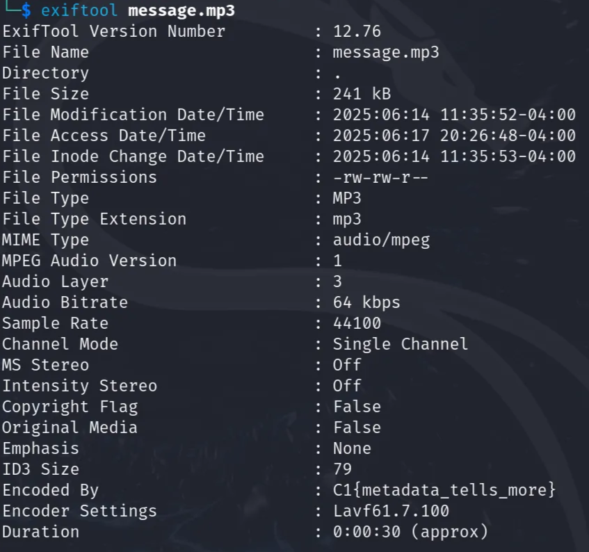

Very Easy - 75 points

Tools Used:
* `exiftool`

## Write-Up
Given the file message.mp3 to find a flag within.

In terminal used the command `exiftool message.mp3` to view the metadata.

CTF Flag: **C1{metadata_tells_more}**

