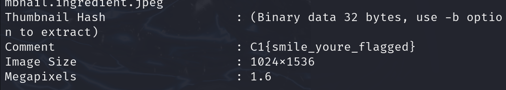

Very Easy - 75 points

Tools Used:
* `exiftool`

## Write-Up
Given a PNG file, there is a flag within. 

Using command `exiftool selfie.png` to see the metadata, the flag is in the comments. 

CTF Flag: **C1{smile_youre_flagged}**

