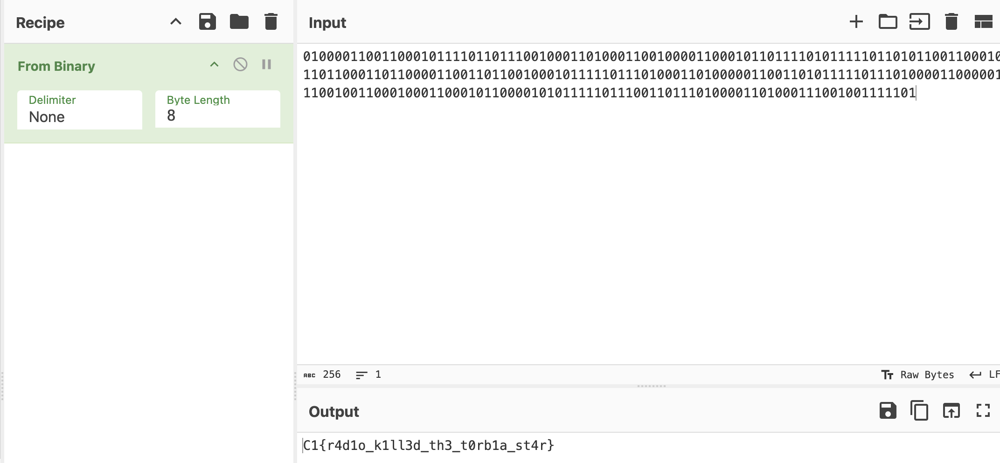

Medium - 200 points

**SOLVED AFTER EVENT ENDED**

Tools Used:
* CyberChef
* [dtmf.netlify.app/](https://dtmf.netlify.app/)

## Write-Up
Given 2 files that give the same sound: **radio.mp3** and **radio.wav**. 

Thought the sound was morse code but nothing useful extracted.

There were 2 tones, a high tone and a low tone. It was **binary**. 

Use [dtmf.netlify.app/](https://dtmf.netlify.app/) to decode sound into binary text.

Used CyberChef to convert binary into plaintext.

CTF Flag: **C1{r4d1o_k1ll3d_th3_t0rb1a_st4r}**

