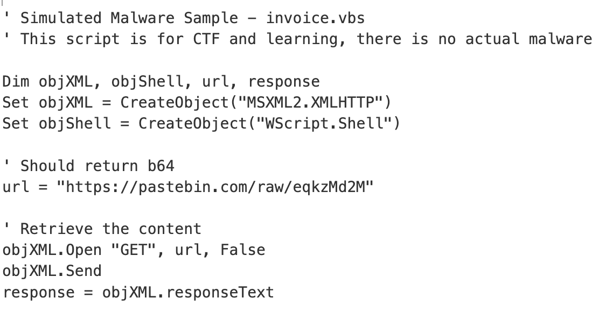

Very Easy - 75 points

Tools Used:
* CyberChef

## Write-Up
Given **invoice.vbs file**, used CyberChef to read file contents.

The script contains a link that states it would return **b64**.

Open the link to be given the ciphertext. Then use CyberChef to decode Base64 into plaintext. 

CTF Flag: **C1{n0_d3bug_n0_p4yn}**