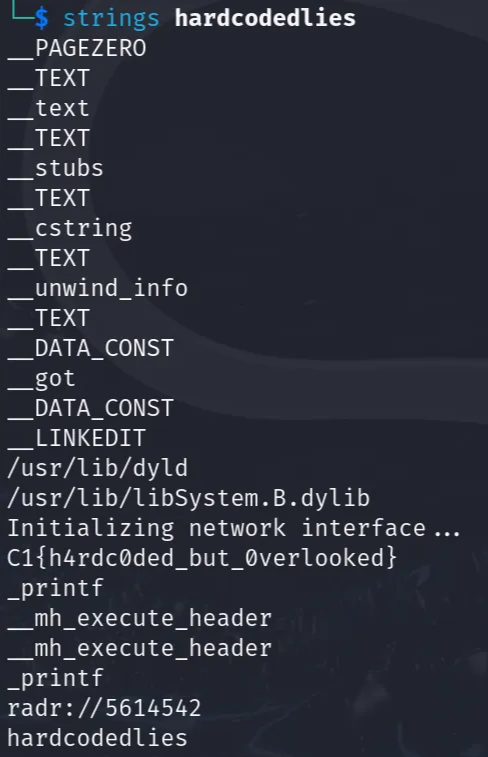

Very Easy - 75 points

Tools Used:
* `strings`

## Write-Up
Given a zip file called **hardcodedlies.zip**, unzip in terminal using command `unzip hardcodedlies.zip`. 

The extracted file was **hardcodedlies**.

Then use command `strings hardcodedlies` to see flag.

CTF Flag: **C1{h4rdc0ded_but_0verlooked}**

