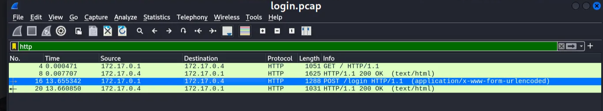
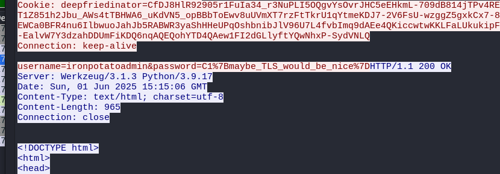

Very Easy - 75 points

Tools Used:
* wireshark

## Write-Up
Given pcap **login.pcap**, find the password to construct the flag. 

Using wireshark, filter by **HTTP** and select packet **16**, which mentions **/login**. 

**Follow TCP steam** to view detailed view where the username and password is shown.

CTF Flag: **C1{maybe_TLS_would_be_nice}**

