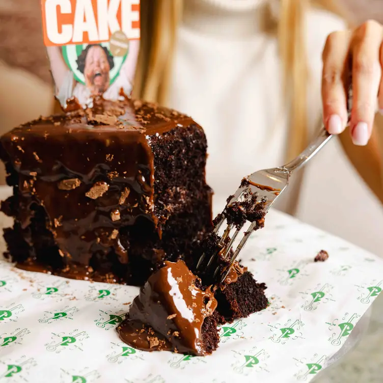
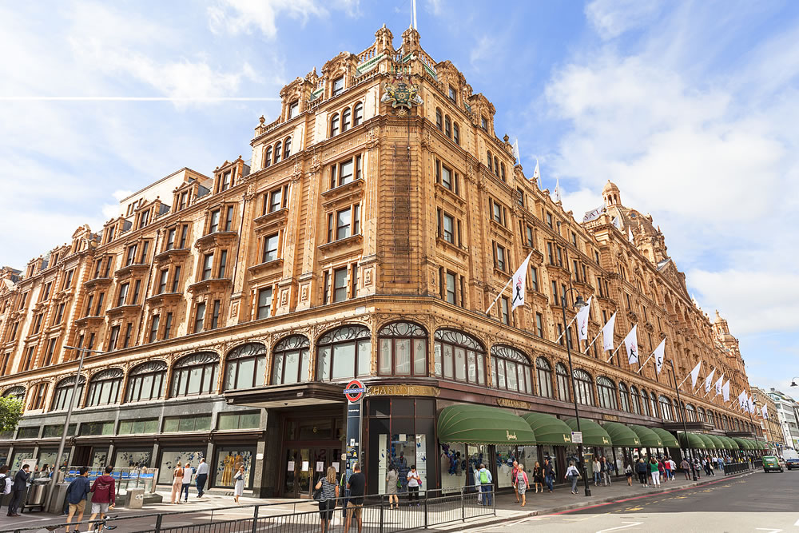
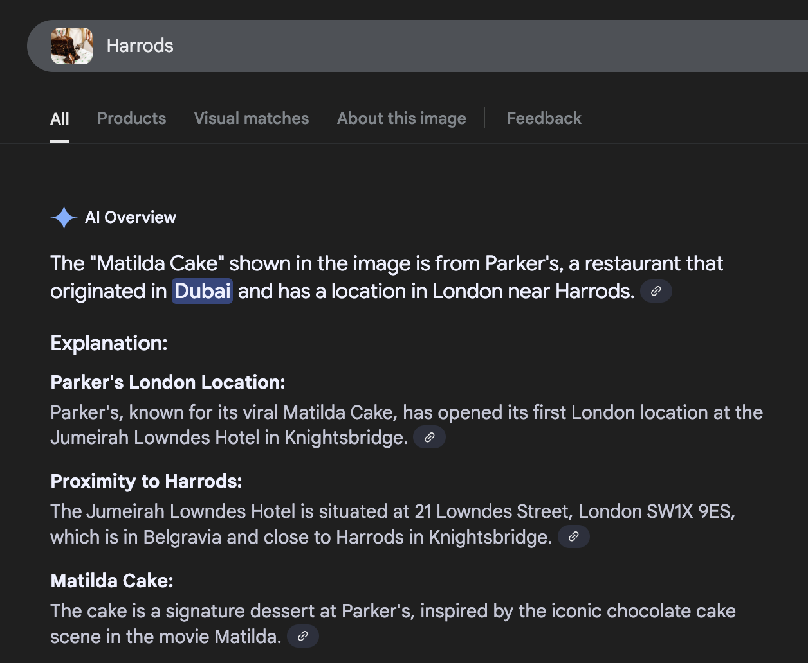

Very Easy - 75 points

No Tools Used

## Write-Up
Given 2 images, need to use information found to construct the flag. First part of the flag is the cafe name and the second part os the street name.

  

Reverse google search the second image to see it is a building of **Harrods**. Now reverse google search the first image with the word Harrods to find a bakery nearby called Parker’s on Lowndes street.

CTF Flag: **C1{Peter’s_Lowndes}**

