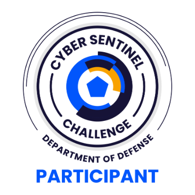
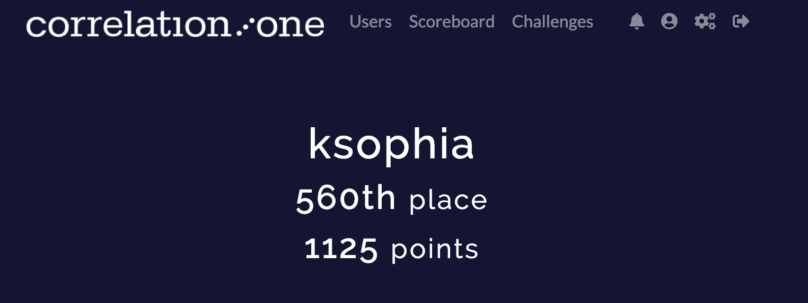

# DoD Cyber Sentinel

  

This is a writeup for the challenges in the 2025 DoD Cyber Sentinel. 

Note: I did not take any photos during the event, so these screenshots were either 
* taken from other writeups if it involves a site or network
* taken afterwards if it involves a file that was previously downloaded

## Event Details

Hosted by Correlation One

Date: June 14th 2025, 11:00AM - 7:00PM ET

Challenges Difficulty:
* Very Easy - 75 points
* Easy - 150 points
* Medium - 200 points
* Hard - 300 points

Tools Used:
* Burp Suite
* [CyberChef](https://gchq.github.io/CyberChef/)
* [dcode.fr/en](http://dcode.fr)
* [DTMF Decoder](https://dtmf.netlify.app/)
* `exiftool`
* `strings`
* TOR Browser
* [jwt.io](http://jwt.io)
* `unzip`
* wireshark

## 🏆 Placement & Points

The following image shows final ranking and total points earned:

  

