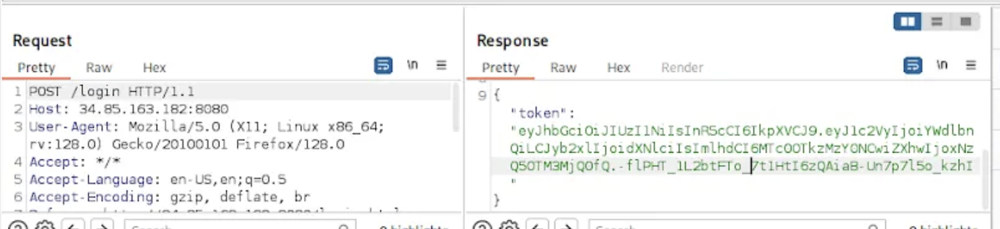
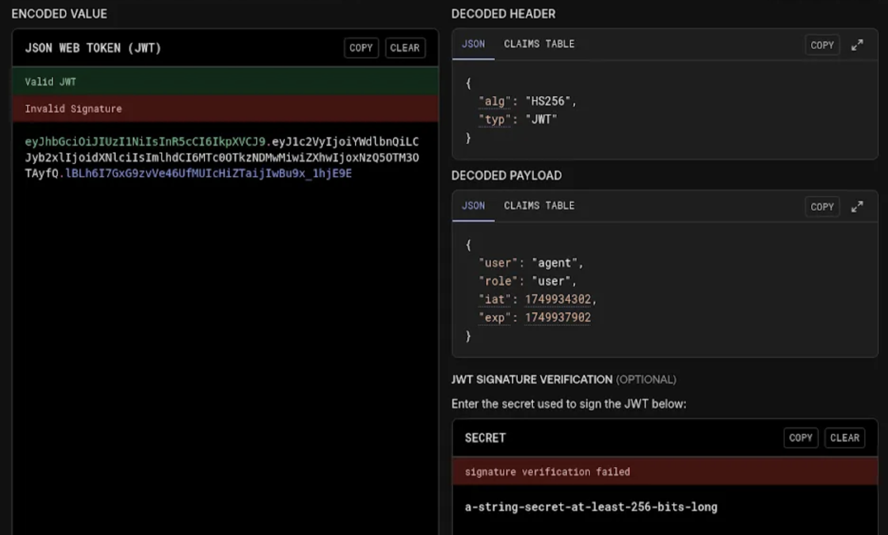
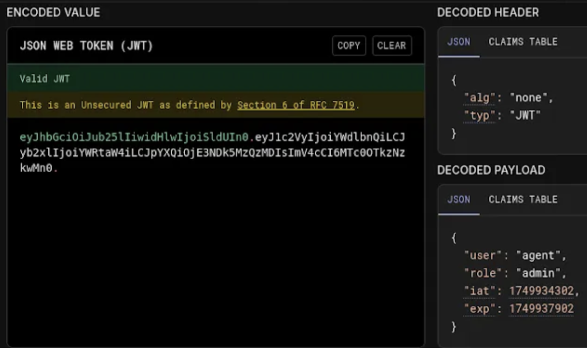
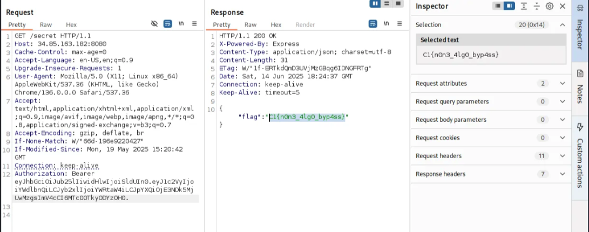

Medium - 200 points

Tools Used:
* Burp Suite
* [dcode.fr/en](http://dcode.fr)
* [jwt.io](http://jwt.io)

Resources:
* [authentication/bearer-authentication/](https://swagger.io/docs/specification/v3_0/authentication/bearer-authentication/)

## Write-Up
Given a website and login credentials, prompt told to go to **/secret** to find the flag. Used Burp Suite to intercept logging in and send to Repeater, the page displays a token. 

Using [dcode.fr/en](http://dcode.fr) to identify the cipher, I discovered it was a **JWT Token**.

Then used [jwt.io](http://jwt.io) to decode the JWT Token and CyberChef to edit the token
* In the header, changed alg value from HS256  to none
    * This bypasses signature verification
* In the payload, changed role value from user to admin
    * This gives us the privilege we need

Back to Burp Suite Repeater, we manipulate the request headers
- Request to go to secret page: **GET /secret**
- Add a request header: **Authorization: Bearer [new_token]**
    - An HTTP authentication scheme
    - Can be understood as “give access to the bearer of this token”
    - Without Bearer, the request would fail

CTF Flag: **C1{n0n3_4lg0_byp4ss}**

