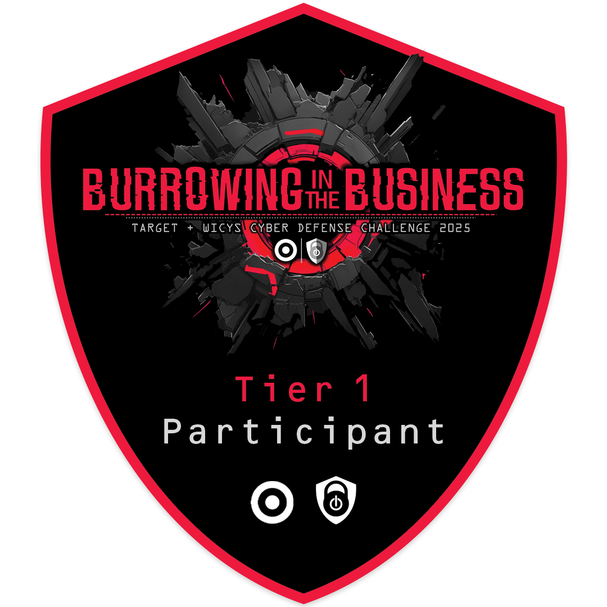

# Target Cyber Defense

This is a writeup for the challenges in the 2025 Target Cyber Defense Challenge. 

## 📋 Tiers & Progress

| Tier | Badge | Description |
|------|-------|-------------|
| [Tier 1: Play the Defender](./Tier1/Tier1.md) |  | 🛡 A ransom demand has been received. Identify the intrusion and determine how data was exfiltrated. |
| [Tier 2: Execute the Attack](./Tier2/Tier2.md) |   | ⏳ Rewind the clock and conduct the attack. |

## Event timeline (2025)

Tier 1 (Defender)
- Active: July 1 – August 14, 2025
- Grace period (not scored): Aug 15 – Aug 20, 2025

Tier 2 (Attacker)
- Active: August 21 – September 18, 2025
- Grace period (not scored): Sept 19 – Oct 3, 2025
- Note: Tier 1 challenges were also available in Tier 2 window for continued attempts.