# D10. Backup Break-in
**Objective:** Locate the leaked credentials on the backup server.

**Difficulty:** Easy (100 points)

**Category:** Credential Exposure, Data Discovery, Forensics

## Materials and References
- **Provided:**
    - Link: backup server `target-securevault.chals.io`
- **Tools Used:**
    - Web browser
    - Text editor (VSCode)
    - Python 3
    - CyberChef
- **References:**
    - [w3schools: atob](https://www.w3schools.com/jsref/met_win_atob.asp)
- **Notes:**
    - Findings from D9:
        - Username of the Git committer is `elesiuta`

## Flag Format
**Format:** password that starts with "wicys"

The flag is the password for the credentials found on the backup server. Do not include the username in submission.

## Write-Up

Opened the given backup server called Secure Vault Enterprise and arrived at the login page.

Default credential attempts (such as `admin` or `password`) failed. 

  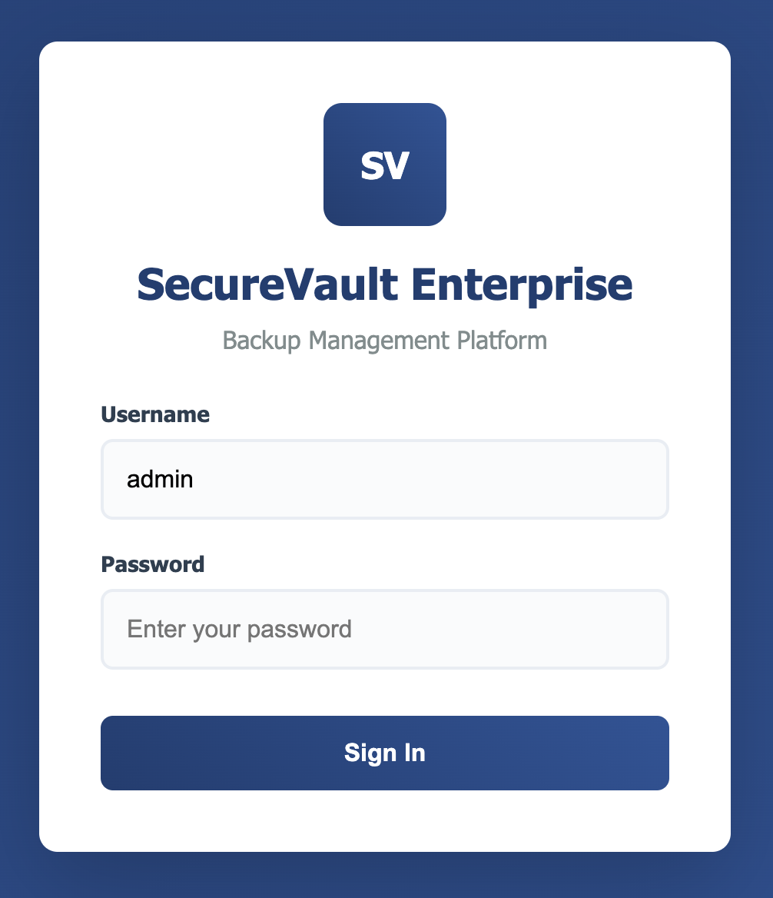

right-click → **View Page Source** to inspect the page HTML. Searching for `admin` revealed a ciphered credential entry:
> admin: atob("V2lDeXNfU2VjdXJlVmF1bHRfQ2hhbGxlbmdlXzIwMjUh")

  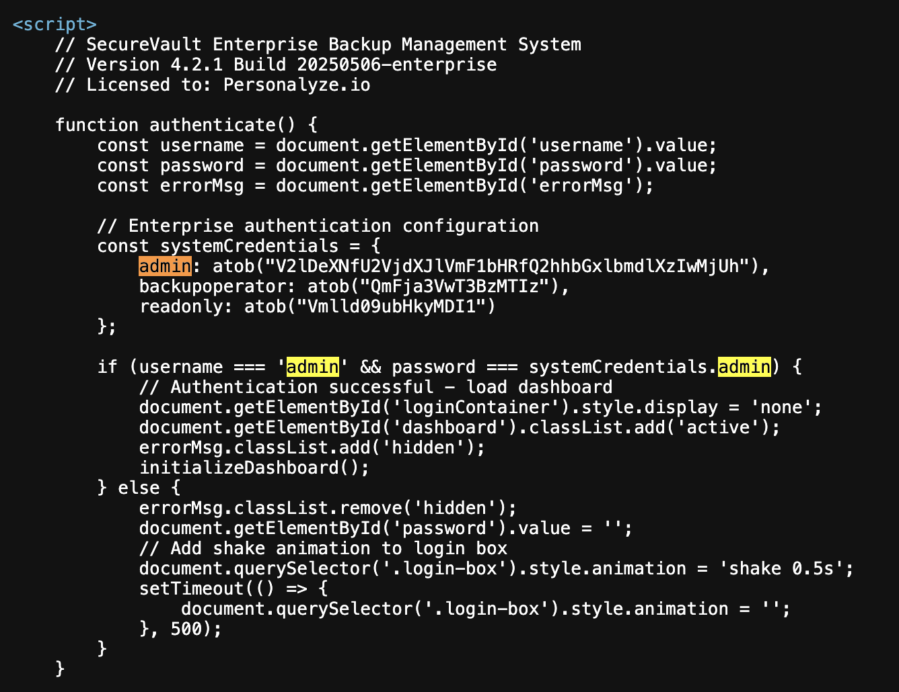

`atob` decodes Base64 in JavaScript. The Base64 string was decoded in CyberChef.

  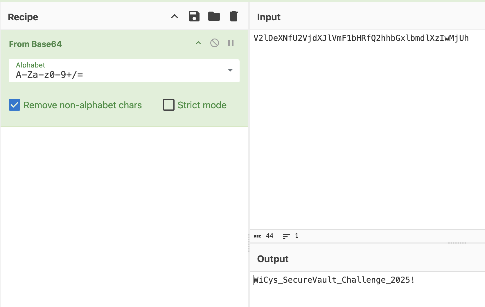

Logged in with the decoded credentials:
- username: `admin`
- password: `WiCys_SecureVault_Challenge_2025!`

The backup server listed 4 recent backup jobs with only one was available for download called `MAIN-SERVER-01`. 

  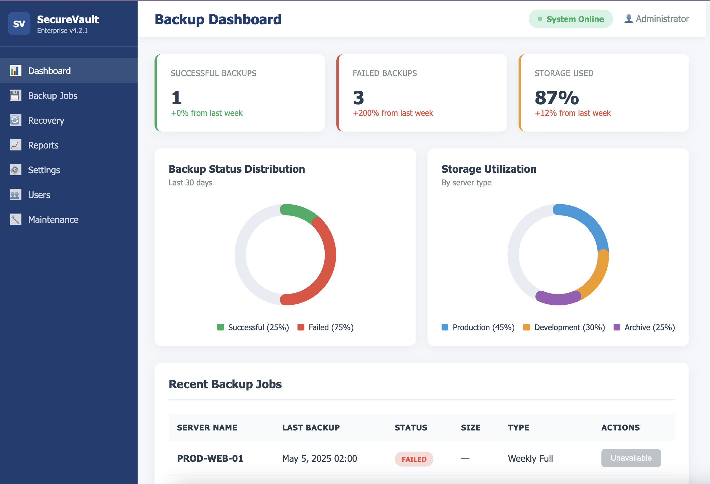
  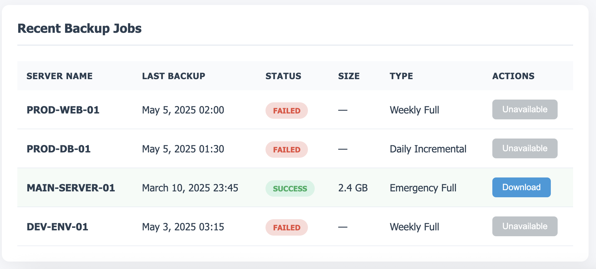

Downloading the file produced `main-server-01-backup.tar.gz`. The zipfile was unzipped/extracted by double-clicking.

The extracted content was a `personalyze_server` directory containing 6 directories:
- Corp:
- Dev:
- HR:
- IT:
- Marketing:
- Sales:

An initial search for terms like `elesiuta` and `username` returned no useful results.

Search focus shifted to the term `password`. Did find a SMTP passwords but it is not relevant for this case as it was for for username elesiuta.

A Slack archive was also discovered under a `Slack folder:`, which contained the files:
- `slack_archive.zip`
- `slack_viewer.py`

  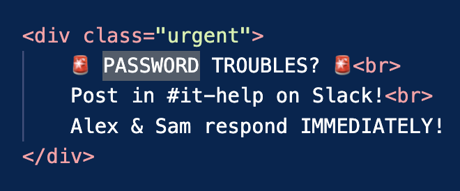
  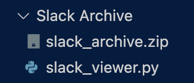

`slack_viewer.py` did not work initially because `slack_archive.json` was missing. The json file was likely within the zipfile. 

The file `slack_archive.zip` was unzipped using CyberChef, which extracted `slack_archive.json`.

  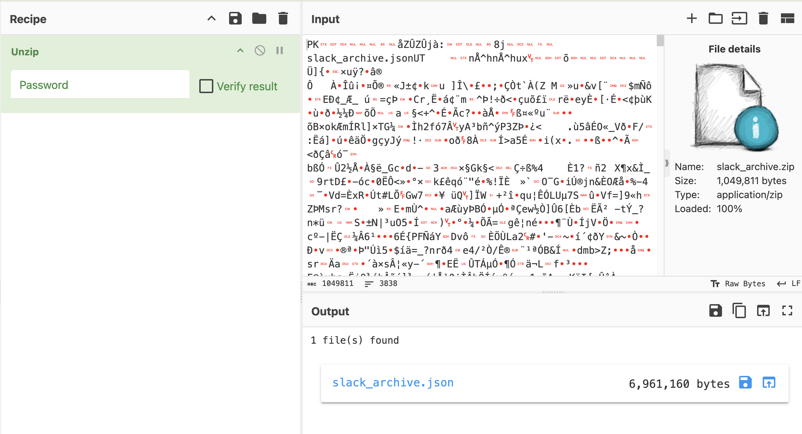

Two methods were used to locate the leaked credential within the Slack data:

**Method A — Direct JSON search**  
- An initial search for `elesiuta` returned over 500 matches. Instead, searched for the term `password` and looked to see where the user was mentioned.
- One message contained an API request with the ciphered credentials. 

  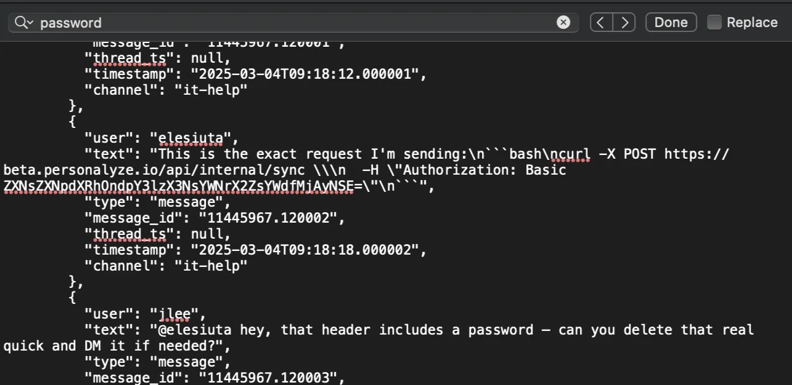

**Method B — Slack viewer**  
- `slack_archive.json` was moved into the same folder as `slack_viewer.py` and the script was executed. This produced `slack_archive.html`.  
- `slack_archive.html` was opened in a browser. The `#it-help` channel was selected and searched for the term `password` within the channel. One message revealed to contained an API request with the ciphered credentials. 

  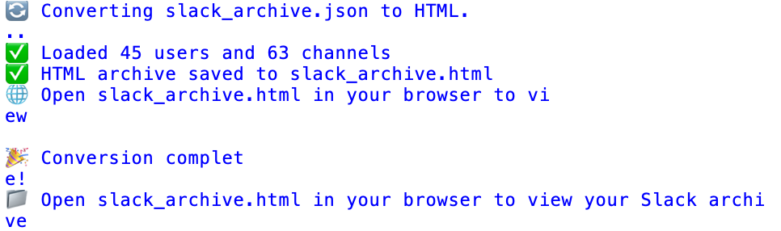
  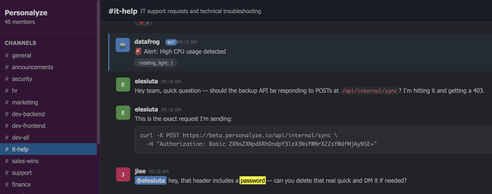

The ciphertext from the Slack message was decoded using CyberChef and revealed the username and password:

`eslesiuta:wicys_slack_flag_2025!`

  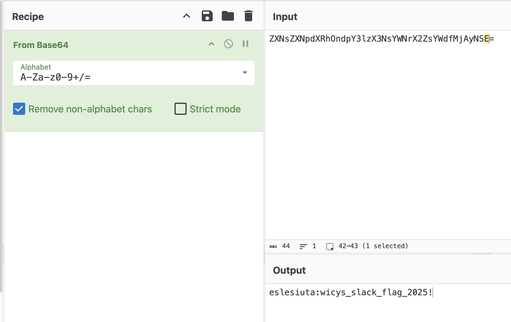

---

**Flag**: `wicys_slack_flag_2025!`