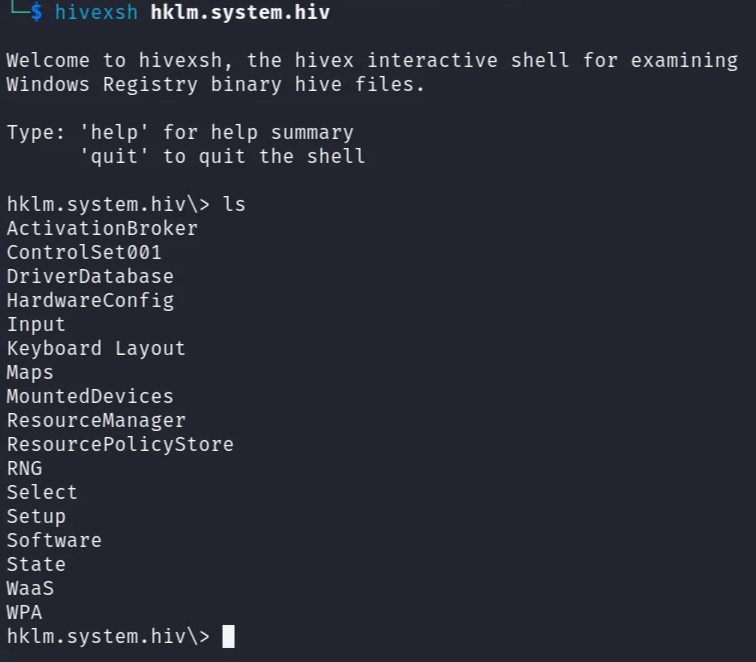
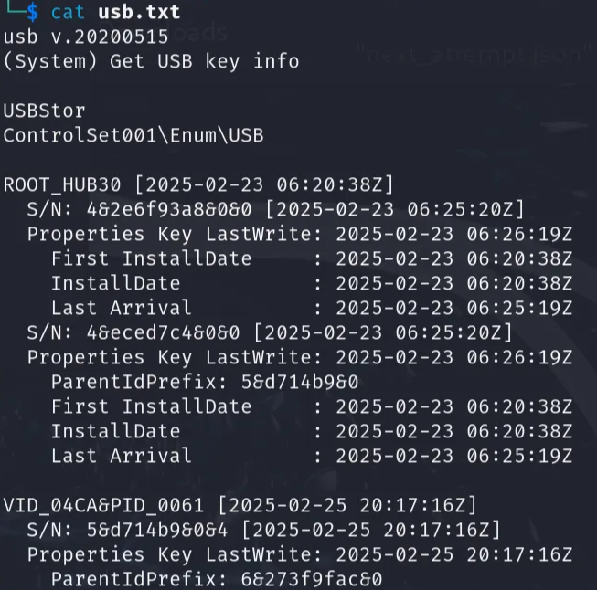
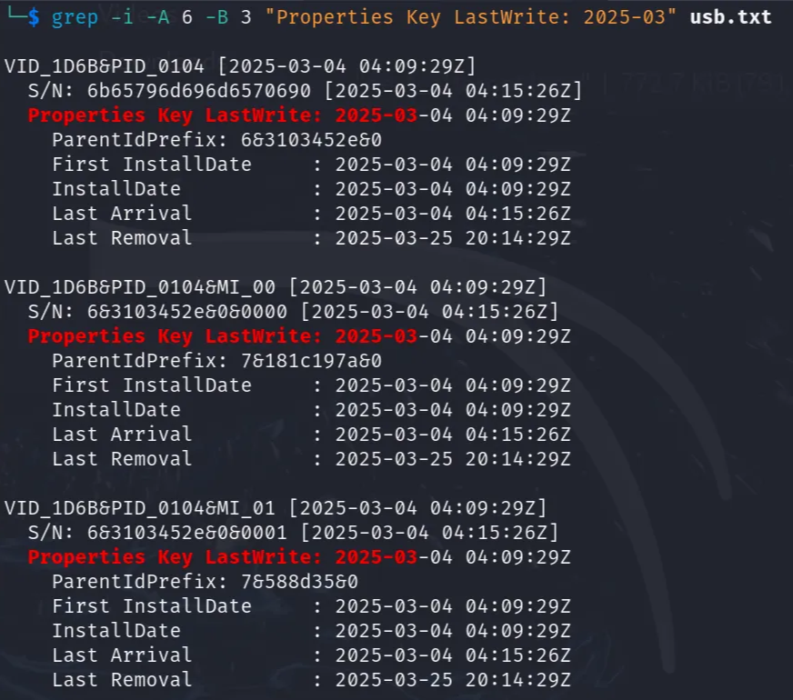
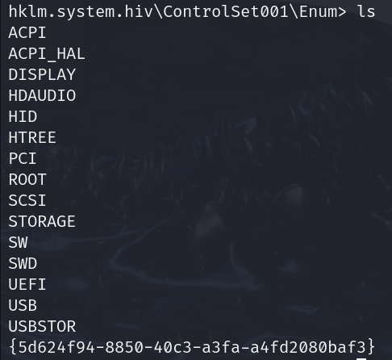
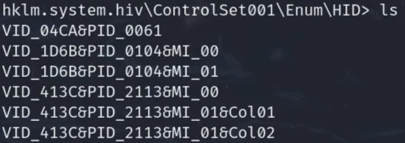
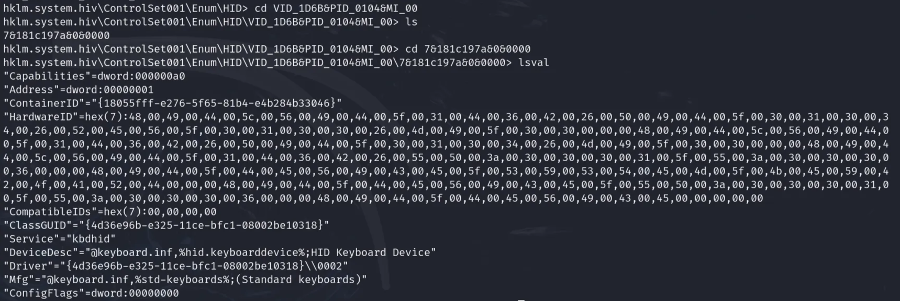
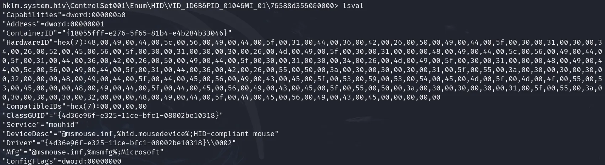

# D11. Semi-Final Boss
**Objective:** Find one suspicious registry key.

**Difficulty:** Medium (300 points)

**Category:** Windows Forensics

## Materials and References
- **Provided:**
    - Registry hive: `hklm.system.hiv`
    - Resource link: [Windows Registry Forensics Cheat Sheet](https://www.cybertriage.com/blog/windows-registry-forensics-cheat-sheet-2025/)
- **Tools Used:**
    - Terminal
    - `hivexsh`
    - grep
    - RegRipper3.0
    - CyberChef
- **References:**
    - [hivexsh](https://man.archlinux.org/man/hivexsh.1.en)
    - [RegRipper3.0](https://github.com/keydet89/RegRipper3.0)
    - [hid documentation](https://learn.microsoft.com/en-us/windows-hardware/drivers/ddi/_hid/)

## Flag Format
**Format:** registry key path

Example: `HKCU\Software\Policies\Microsoft\Windows\WindowsCopilot\TurnOffWindowsCopilot`

Submission is regex-matched, so as long as the path is correct, it will be accepted.

## Write-Up

Opened the registry hive `hklm.system.hiv` with the following command:
```Bash
hivexsh hklm.system.hiv
```

<p align="center">
  
</p>

The challenge was vague in only asking to locate a suspicious registry key and the attempts were limited to avoid brute forcing. Investigation was performed across many areas.

Used `ls` to enumerate keys and `lsval` to inspect value pairs.

Initial focus areas included:
- `Software`
- `ControlSet001\Services`
- `ControlSet001\Control`

RegRipper was used to accelerate analysis. The following commands generated two reports::
- `system_report.txt`
- `services_report.txt`
```Bash
perl /home/kali/Desktop/RegRipper3.0/rip.pl -r hklm.system.hiv -f system > system_report.txt
perl /home/kali/Desktop/RegRipper3.0/rip.pl -r hklm.system.hiv -p services > services_report.txt
```

`grep` was used to filter the report files for keywords, but initial queries did not reveal a clear suspicious key:
- Run
- Temp
- ImagePath
- Execute

A hint indicated that the device is suspected to be remotely controlled. Investigation shifted to entries that would allow the attacker see and control the laptop remotely without special software.

`ControlSet001\Control\Terminal Server` was inspected because it is commonly associated with RDP, but it did not contain anything useful.

Used `grep` to query for terms related for RDP, but did not reveal any clear suspicious key:
- view
- monitor
- exe
- remote
- mounteddevice
- usb

A second hint suggested to look for IP KVMs (network keyboard, video, and mouse) and that evidence can be found in the device enum of the registry from the more recently plugged in devices.

Used `hivexsh` to view devices in `ControlSet001\Enum\USB`.

The registry key timestamps are stored in FILETIME format, making them unreadable directly in `hivexsh`. For example:
> "@"=hex(4294901776):56,b5,b8,39,bb,8c,db,01

Rather than navigating every entry and manually converting each value, used RegRipper to extract USB device information and timestamps. The following command was used to generate the list and save it to `usb.txt`:
```Bash
perl /home/kali/Desktop/RegRipper3.0/rip.pl -r hklm.system.hiv -p usb > usb.txt
```

Read file with command: 
```Bash
cat usb.txt
```

<p align="center">
  
</p>

Focused attention to **Properties Key LastWrite** values. Most devices were installed in February. The most recent month was **March** so filtered for these devices with the command:
```Bash
grep -i -A 6 -B 3 "Properties Key LastWrite: 2025-03" usb.txt
```

3 usb devices matched the March timestamp:
- `VID_1D6B&PID_0104`
- `VID_1D6B&PID_0104&MI_00`
- `VID_1D6B&PID_0104&MI_01`

These devices were installed and removed at the same time while sharing a similar name pattern of `VID_1D6B&PID_0104`. This suggests that these devices are likely the IP KVMs (network keyboard, video, and mouse) referenced by the given hint.

<p align="center">
  
</p>

Used lsval in hivexsh to view descriptions for these entries:
- VID_1D6B&PID_0104          → USB Composite Device
- VID_1D6B&PID_0104&MI_00    → USB Input Device
- VID_1D6B&PID_0104&MI_01    → USB Input Device

The device parameters and properties held useful results. However, the devices themselves only show generic USB IDs. Further investigation is needed to determine what they are actually acting as.

Although the hint mentioned the device enum section, it did not specifically state USB. Focus went back to `ControlSet001\ENUM` to explore other directories.

After some research, it was found that `HID` stands for `Human Interface Devices`. It is defined as “devices that humans use to directly control the operation of computer systems”.

This directory was selected to investigate next.

<p align="center">
  
</p>

Inside HID directory, familiar devices were found:
- `VID_1D6B&PID_0104&MI_00`
- `VID_1D6B&PID_0104&MI_01`

<p align="center">
  
</p>

Each device’s key-value pairs were investigated and the hex values were decrypted using CyberChef.

`VID_1D6B&PID_0104&MI_00` revealed:
- device description contains `Keyboard Device`
- service is kbdhid
- hardware id is HID\VID_1D6B&PID_0104&REV_0100&MI_00HID\VID_1D6B&PID_0104&MI_00HID\VID_1D6B&UP:0001_U:0006HID_DEVICE_SYSTEM_KEYBOARDHID_DEVICE_UP:0001_U:0006HID_DEVICE

<p align="center">
  
</p>

`VID_1D6B&PID_0104&MI_01` revealed:
- device description contains `mousedevice`
- service is mouhid
- hardware id is HID\VID_1D6B&PID_0104&REV_0100&MI_00HID\VID_1D6B&PID_0104&MI_00HID\VID_1D6B&UP:0001_U:0006HID_DEVICE_SYSTEM_KEYBOARDHID_DEVICE_UP:0001_U:0006HID_DEVICE

<p align="center">
  
</p>

These devices are the IP KVMs, specifically the keyboard and mouse. 

The first interface was submitted as the flag. The second interface would also have been accepted.

---

**Flag**: `ControlSet001\Enum\HID\VID_1D6B&PID_0104&MI_00\7&181c197a&0&0000`