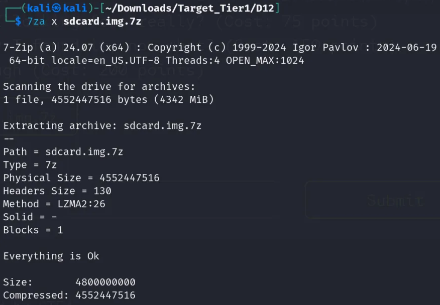
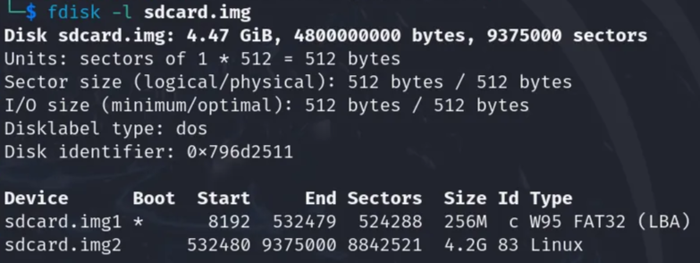
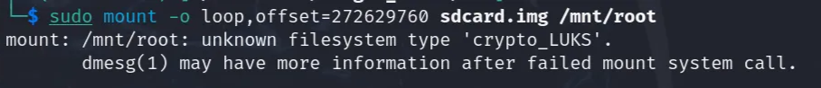
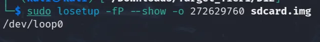
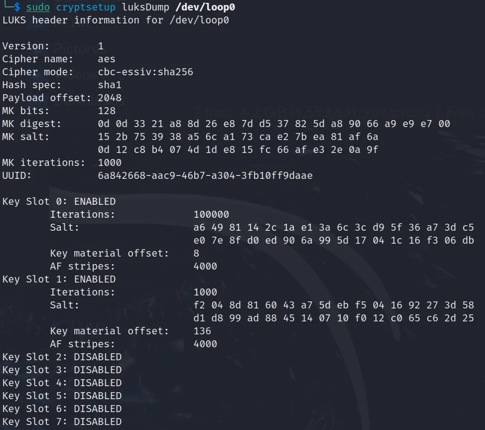
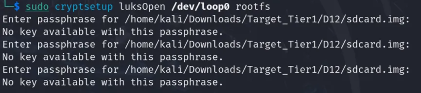
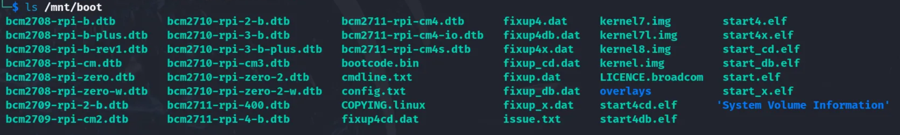

# D12. Final Boss
**Objective:** Discover an IOC in a disk image.

**Difficulty:** Hard (500 points)

**Category:** Linux Forensics

## Materials and References
- **Provided:**
    - Disk image (sd card): `sdcard.img.7z`
    - Resource link: [Linux-Forensics-cheatsheet](https://fareedfauzi.github.io/2024/03/29/Linux-Forensics-cheatsheet.html#disk-imaging-using-dd)
- **Tools Used:**
    - Linux VM
    - Terminal
- **References:**
    - [stackexchange: how-to-mount-a-disk-image-from-the-command-line](https://unix.stackexchange.com/questions/316401/how-to-mount-a-disk-image-from-the-command-line)
    - [stackexchange: can-i-mount-a-partition-from-a-full-drive-image](https://unix.stackexchange.com/questions/230630/can-i-mount-a-partition-from-a-full-drive-image)
    - [losetup](https://linux.die.net/man/8/losetup)
    - [openssl-enc/](https://docs.openssl.org/3.0/man1/openssl-enc/)
    - [umount](https://linux.die.net/man/8/umount)
    - [cryptsetup](https://linux.die.net/man/8/cryptsetup)

## Flag Format
**Format:** a typical IOC value

Example: 
- `https://www.example.com/`
- `0.0.0.0`
- `user@example. com`

## Write-Up

Unzip the given disk image using the command below. The extracted file was `sdcard.img`.
```Bash
7za x sdcard.img.7z
```

<p align="center">
  
</p>

The challenge description states the SD card has what looks like a RaspberryPi boot partition.

Run command to list partition tables:
```Bash
fdisk -l sdcard.img
```
2 partition tables were discovered:
- `W95 FAT32 (LBA)` Partition with size 256MB
    - Possible the RaspberryPi boot partition, will refer as boot partition
- `Linux` Partition with size 4x2GB
    - Will refer to this as our root partition

<p align="center">
  
</p>

### Mounting Partitions

Need to mount the partition to analyze it. 

**Root Partition**

Focus was placed on mounting the root (Linux) partition to inspect its contents. Since this partition is larger, it is likely the main filesystem and may contain the IOC.

To mount, the byte offset of the root partition needs to be calculated. This value represents where the root partition begins inside `sdcard.img`.

```text
Start sector  * sector size  = 532480 * 512 = 272629760
```

Create a mount point with the command below. This will be the folder where the partition's contents will appear once the disk image partition is mounted.

```Bash
sudo mkdir /mnt/root
```

Then mount the root partition using the calculated offset with the command:

```Bash
sudo mount -o loop,offset=272629760 sdcard.img /mnt/root
```
- `sudo`: Required to mount file systems
- `mount`: The mount command
- `o loop`: Treats the image file as a block device
- `offset=272629760`: Byte offset where the partition starts
- `sdcard.img`: The full disk image file
- `/mnt/root`: Where to mount it

<p align="center">
  
</p>

The mount failed with an unknown filesystem type indicating crypto_LUKS:
> mount: /mnt/root: unknown filesystem type 'crypto_LUKS' .\
dmesg(1) may have more information after failed mount system call.

To unlock the partition, first create a loop device for the root partition using the command:

```Bash
sudo losetup -fP --show -o 272629760 sdcard.img
```
- `losetup`: Tool to create loop devices
- `-fP`: Automatically finds a free loop device and parses partitions
- `--show`: Displays the loop device name (e.g., /dev/loop0)
- `o 272629760`: Offset to the encrypted partition

<p align="center">
  
</p>

Verify it's encrypted with LUKS with command:

```Bash
sudo cryptsetup luksDump /dev/loop0
```

<p align="center">
  
</p>

Run the following command to unlock the root partition (prompts a passphrase). Default credentials (such as password) was tested first but failed.
- If correct passphrease, makes the decrypted device available at `/dev/mapper/rootfs`

```Bash
sudo cryptsetup luksOpen /dev/loop0 rootfs
```

<p align="center">
  
</p>

The passphrase is given or not known at this point. Since the partition is encrypted, the IOC is likely stored inside. The passphrase may be in the boot partiton, therefore it is mounted next to investigate.

**Boot Partition**

Mount the boot partition to search for a potential password of the root partition.

Calculate the boot partition offset with the expression:
```text
Start sector  * sector size  = 8192 * 512 = 4194304
```

Use the following commands to create a mount point and mount the boot partition using the calculated offset. The direct mount failed due to an existing loop device on the root partition.
```Bash
mkdir /mnt/boot #mount point
sudo mount -o loop,offset=4194304 sdcard.img /mnt/boot #attempt to mount boot partition
```

Another loop device needs to be created for the boot partition. Run the commands below to create a separate loop device for the boot partition and mount that device instead:
```Bash
sudo losetup -fP --show -o 4194304 sdcard.img #loop device for boot partition
sudo mount /dev/loop1 /mnt/boot #mount boot partition
ls /mnt/boot #see directory in boot partition
```

<p align="center">
  
</p>

There are only 3 txt files within the boot partiton. Each were inspected but none contained the password needed to unlock the root partition.
