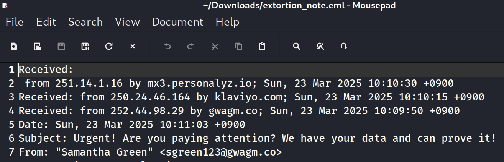

# D1. Mystery Mail
**Objective:** Identify the sender's IP address using the attached email file.

**Difficulty:** Easy (100 points)

**Category:** Email Analysis, Forensics

## Materials and References
- **Provided:**
    - File: `extortion_note.eml`
- **Tools Used:**
    - Text editor (e.g., Mousepad on Kali Linux)

## Flag Format
The flag will be a valid IP address.

Example:
- 242.229.211.211
- 243.151.196.173

## Write-Up

The email file was opened using a text editor (Mousepad in Kali Linux) to inspect its contents. 
There were 3 IP addresses in the email headers.

Based on standard email structure, the original sender's IP address is in the first **Received** header, which was located on the fourth line of the file.

**Flag:** `252.44.98.29`

