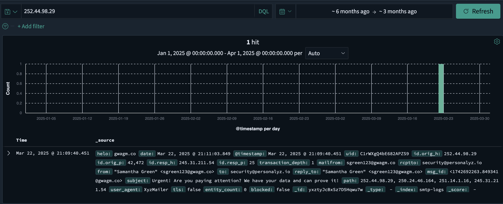
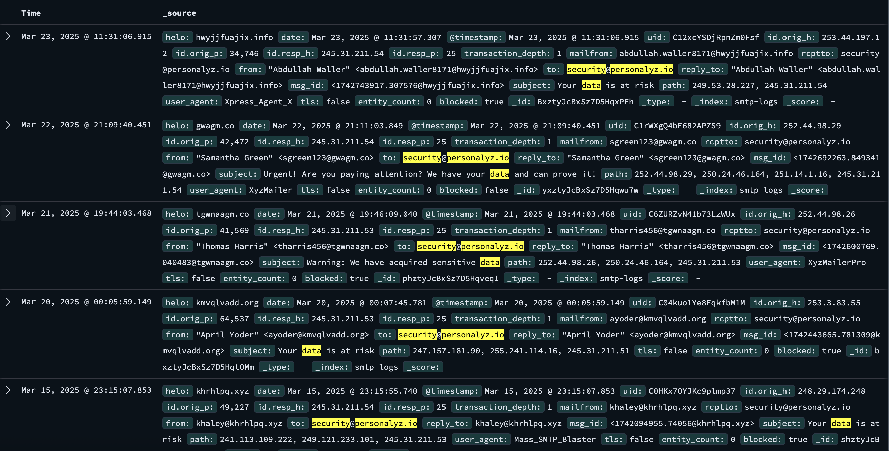
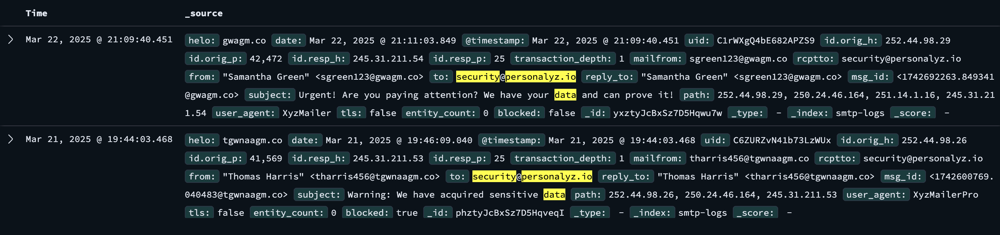
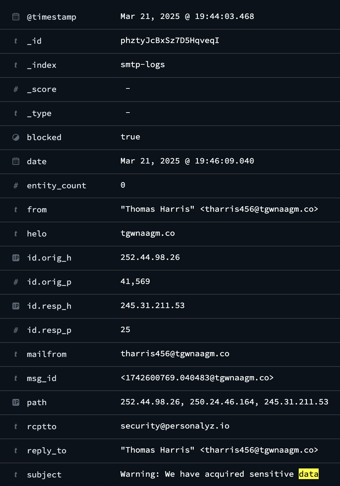

# D2. Not-so-Simple Mail Protocol (100)
**Objective:** Find the first extortion email sent by the threat actor.

## Challenge Materials
- Link: `Insightful Horizon` (OpenSearch dashboard)
- Credentials:
  - Username: `analyst`
  - Password: `analyst`

## Resources and Notes
- Tool: OpenSearch Dashboard (via browser)
- Prior knowledge from D1: Sender's IP `252.44.98.29`

## Write-Up

The provided credentials were used to log into Insightful Horizon, an OpenSearch dashboard.

  

From Challenge D1, the sender’s original IP address was identified as `252.44.98.29`. This IP was used to query in the dashbaord to locate the email from the previous challenge and/or any related email logs.

The query revealed an email log that matched the email from D1 with the same contents but with a different timestamp.

To identify the initial extortion attempt, additional filters were applied based on the contents of the email:
- `to: security@personalyz.io`
    - Filters for the email that the attacker attempted to contact.
- `subject: data`
    - Filters for emails related to data theft.

The results contain multiple logs with the subject **“Your data is at risk”** from different emails and containing no useful information. To exclude these emails and refine the search, an exclusion filter was added:
- `NOT subject: Your data is at risk`

The result was reduced to 2 logs. The first log matched the email previously seen in D1. The second log was the first extortion email sent by the threat actor.

Expaning the log revealed the sender's email address.

**Flag:** `tharris456@tgwnaagm.co`

  

