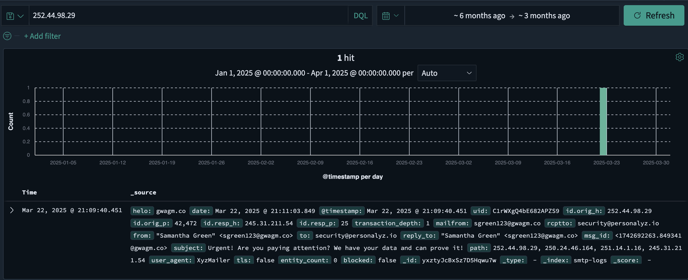
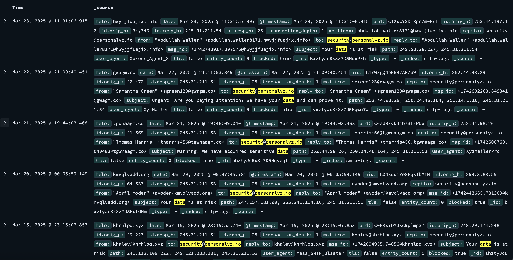
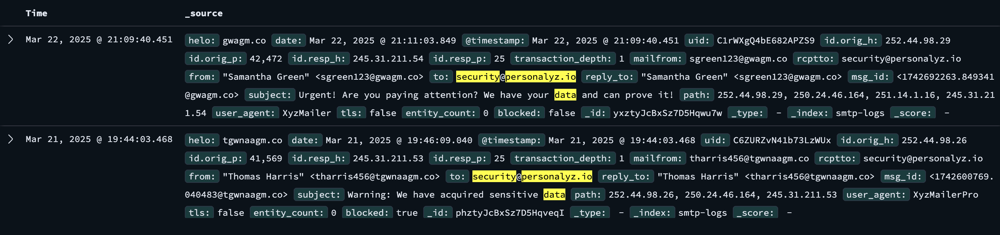
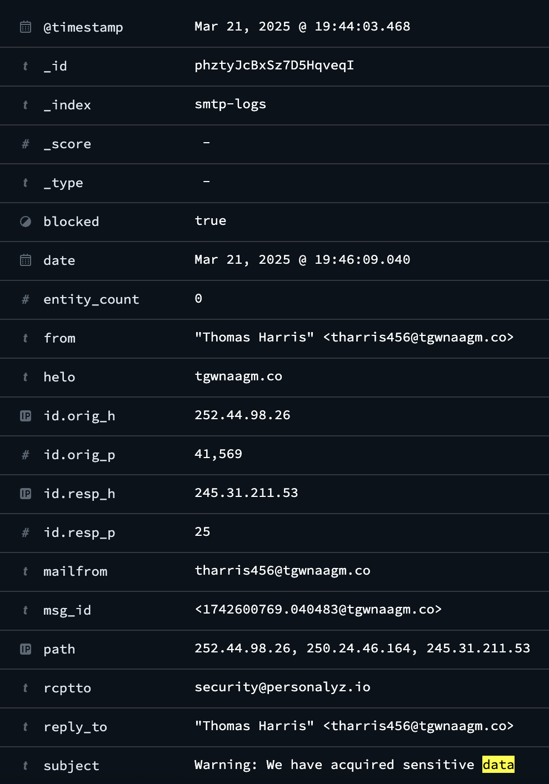

# D2. Not-so-Simple Mail Protocol
**Objective:** Find the first extortion email sent by the threat actor.

**Difficulty:** Easy (100 points)

**Category:** Log Analysis, Email Investigation

## Materials and References
- **Provided:**
    - Link: Insightful Horizon (OpenSearch dashboard)
    - Credentials:
        - Username: analyst
        - Password: analyst
- **Tools Used:**
    - OpenSearch Dashboard (via browser)
- **Notes:**
    - Findings from D1: 
        - Sender's IP `252.44.98.29`

## Flag Format
An email address.

Example: example@wicys.example

## Write-Up

The provided credentials were used to log into Insightful Horizon, an OpenSearch dashboard.

  

Using the sender’s IP address `252.44.98.29` discovered from D1, a query was performed to locate related email logs.

The query revealed an email log that matched the email from D1 with the same contents but with a different timestamp.

To identify the initial extortion attempt, additional filters were applied based on the email contents:
- `to: security@personalyz.io`
    - Filters for logs where an email was sent to this address, which is the email the attacker was attempting to contact.
- `subject: data`
    - Filters for emails referencing data, potentially data theft.

The results contain multiple logs with the subject **“Your data is at risk”** from different emails with no useful information. To exclude these emails and refine the search, an exclusion filter was added:
- `NOT subject: Your data is at risk`

The result was reduced to 2 logs. The first log matched the email previously seen in D1. The second log was the first extortion email sent by the threat actor.

Expanding the log revealed the sender's email address.

**Flag**: `tharris456@tgwnaagm.co`

  

