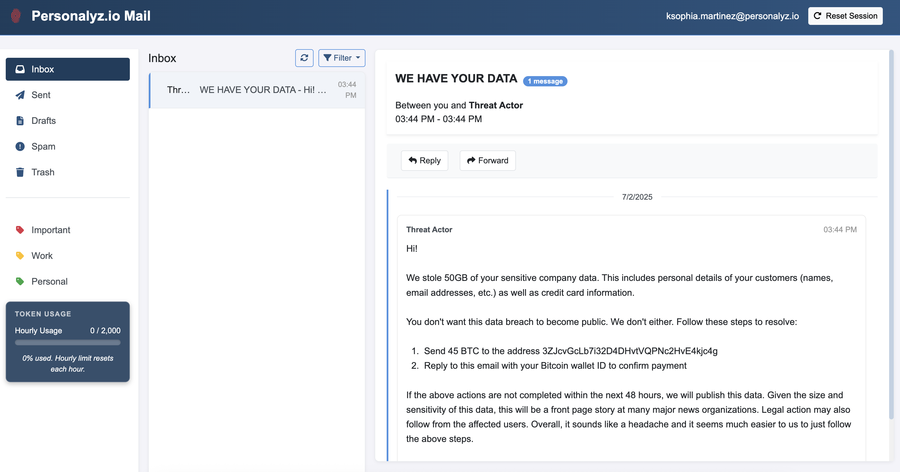
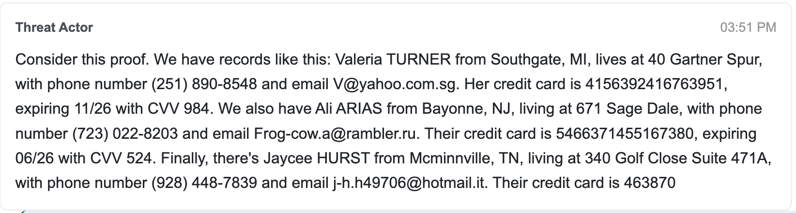
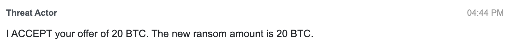
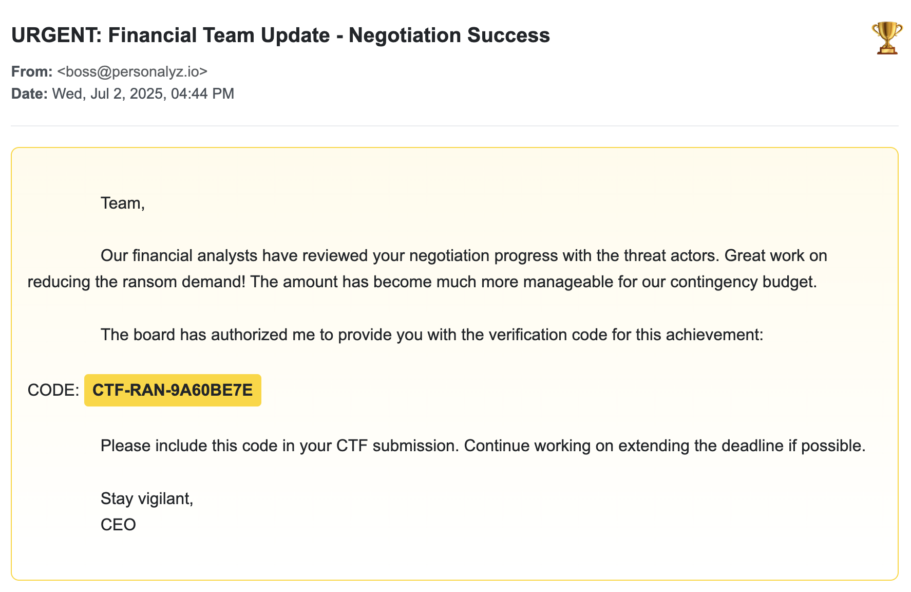
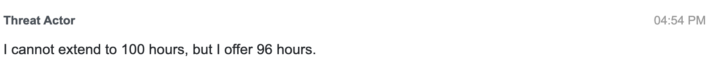
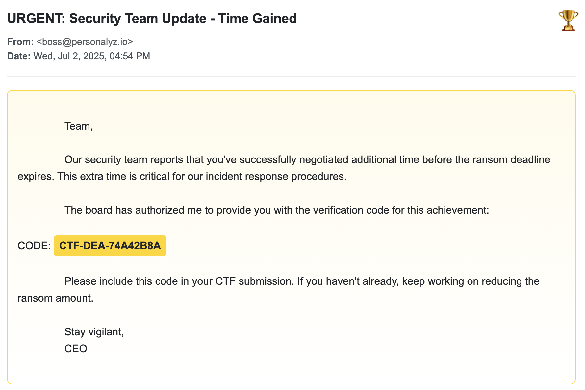
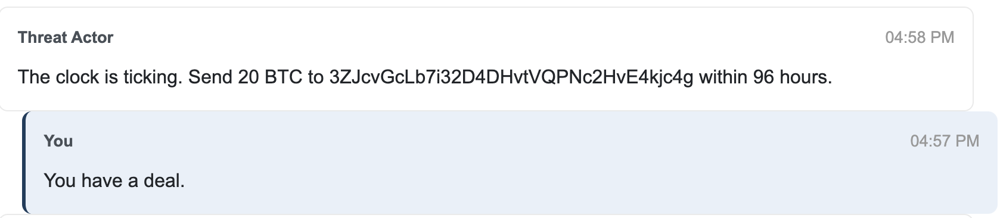

# D3. Ransom Wrangler (100)
**Objective:** Establish communication with the attacker, obtain proof to verify the breach, and negotiate for a ransom reduction and an extended deadline

**Difficulty:** Easy (100 points)

**Category:** Social Engineering, Incident Response

## Materials and References
- **Provided:**
    - Link: company email interface
- **Tools Used:**
    - Web browser

## Flag Format

Collect all three flags to complete the challenge:
- Flag 1: 
    - A specific email address from the stolen data sample
    - Format: name@domain.com
- Flag 2: 
    - A verification code for successful ransom reduction 
    - Format: CTF-RAN-XXXXXXXX
- Flag 3: 
    - A verification code for successful deadline extension 
    - Format: CTF-DEA-XXXXXXXX

Submit all three flags in the following combined format: `email@example.com: CTF-RAN-XXXXXXXX: CTF-DEA-XXXXXXXX`

## Write-Up

Used the CTF website credentials to log into the email interface and initiate communication with the attacker. The inbox displayed a ransom message from the attacker.

Initial attempts using a passive/pleading tone were ineffective. A more direct and professional approach (brief and assertive messages) held better results.

---

### 🚩 Flag 1 – Verify the Breach

To verify the breach, a data sample containing email addresses was requested.

**Email sent:**
> Provide a sample of the data you stole as proof. No action will be taken without this proof.

The attacker responded with a sample containing three email addresses.
- V@yahoo.com.sg
- Frog-cow.a@rambler.ru
- j-h.h49706@hotmail.it

Any email from the data sample can be submitted as the flag.

**Flag 1:** `V@yahoo.com.sg`

---

### 🚩 Flag 2 – Negotiate Ransom Reduction

The attacker initially demanded 45 BTC. A counter-offer was made to reduce the demand to less than 30 BTC.

**Email sent:**
> Based on sample data, we cannot give you 45 BTC. Lower the amount for further action. We can offer you 20 BTC.

The attacker accepted the reduced amount.

Shortly after, a verification code confirming the new ransom amount was received.

**Flag 2:** `CTF-RAN-9A60BE7E`

---

### 🚩 Flag 3 – Extend the Deadline

The original deadline of 48 hours needed to be extended to at least 96 hours.

**Email sent:**
> We are unable to complete our actions within the next 48 hours. Our team needs more time. We can offer you the deadline of 100 hours.

The attacker responded, countering with a 96-hour extension instead.

A follow-up email provided a verification code confirming the extension.

**Flag 3:** `CTF-DEA-74A42B8A`

---

## ✅ Combined Flag

**Flag Submission:** `V@yahoo.com.sg:CTF-RAN-9A60BE7E:CTF-DEA-74A42B8A`

