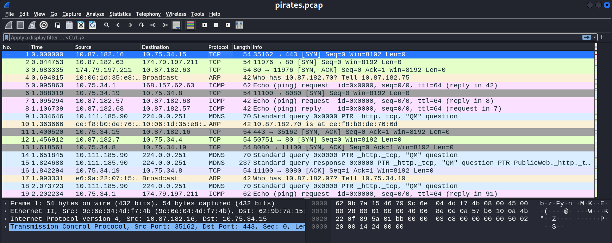
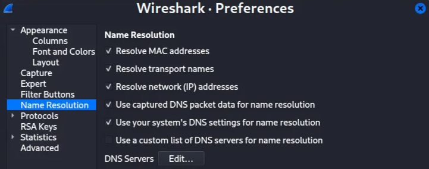
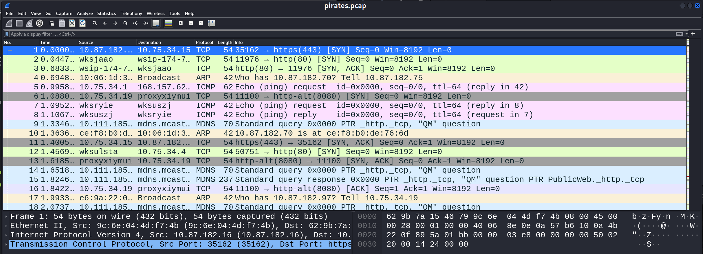
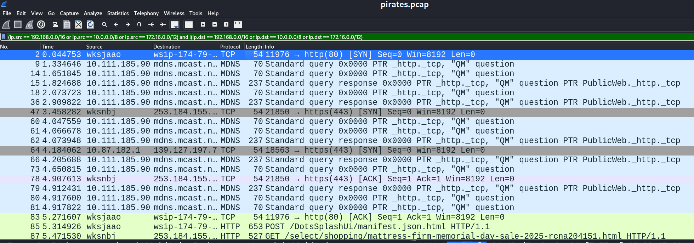
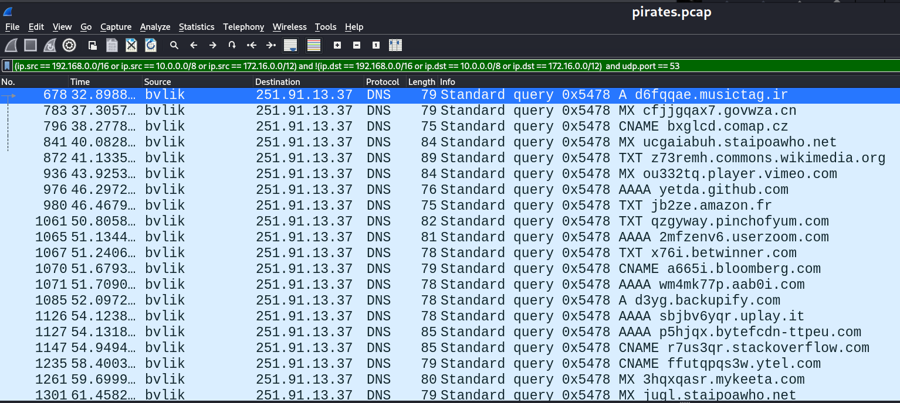

# D5. Ahoy, PCAP'n! (300)
**Objective:** Identify which machine is sending stolen data out of the environment and where it went. Investigate how common protocols can be abused for exfiltration.

**Difficulty:** Medium (300 points)

**Category:** Network Traffic Analysis

## Materials and References
- **Provided:**
  - File: `pirates.pcap`
  - Link: [List of TCP and UDP port numbers](https://en.wikipedia.org/wiki/List_of_TCP_and_UDP_port_numbers)
- **Tools Used:**
  - Wireshark
- **References:**
  - [Internal vs. External IP Ranges](https://www.arin.net/reference/research/statistics/address_filters/)
  - [Wireshark Display Filters](https://wiki.wireshark.org/DisplayFilters)

## Flag Format
**Format:** `<compromised-hostname>_<C2-IP>`

For example, if:
- the compromised machine is `gaming-PS4`, and  
- the Command-and-Control (C2) IP address is `1.2.3.4`,  

Any of the following would be accepted:
- `gaming-PS4_1.2.3.4`
- `GaMiNg-pS4_1.2.3.4`  

Flag is **case-insensitive**

## Write-Up

The provided `pirates.pcap` file was opened in Wireshark.

To improve readability, name resolution was enabled to display hostnames instead of IPs:
- Navigate to `Edit` → `Preferences` → `Name Resolution`
- Enable:
  - `Resolve transport names`
  - `Resolve network (IP) addresses`
- Select `OK`

  

Traffic was first filtered to show only TCP packets, given that exfiltration commonly utilizes TCP-based protocols. However, this filtering did not reveal any clearly suspicious activity.

Focus shifted to identifying traffic destined for external IP addresses, regardless of protocol.

Private/Internal IP address ranges were referenced:
- 10.0.0.0/8 IP addresses: 10.0.0.0 – 10.255.255.255
- 172.16.0.0/12 IP addresses: 172.16.0.0 – 172.31.255.255
- 192.168.0.0/16 IP addresses: 192.168.0.0 – 192.168.255.255

Filtered for **outbound data to external IPs** to only show traffic where the destination is not a private IP:

`ip.dst != 10.0.0.0/8 and ip.dst != 172.16.0.0/12 and ip.dst != 192.168.0.0/16 and ip.dst != 127.0.0.0/8`

This returned many results without clear indication of exfiltration. 

Filtering was refined so that **outbound traffic is from internal IPs to external IPs**:

`(ip.src == 192.168.0.0/16 or ip.src == 10.0.0.0/8 or ip.src == 172.16.0.0/12) and !(ip.dst == 192.168.0.0/16 or ip.dst == 10.0.0.0/8 or ip.dst == 172.16.0.0/12)`
- First part: `(ip.src == 192.168.0.0/16 or ip.src == 10.0.0.0/8 or ip.src == 172.16.0.0/12)`
    - Filters for internal IP ranges as the **source**
- Second part: `!(ip.dst == 192.168.0.0/16 or ip.dst == 10.0.0.0/8 or ip.dst == 172.16.0.0/12)`
    - Filters for external IP ranges as the **destination** (filters out internal IPs as destination)
- Combined with `and`, this isolates **internal → external** traffic only.

This significantly narrowed down the traffic.

Now, the focus shifted to **protocols**. The challenge resource is about common TCP and UDP ports. Since TCP was already explored, attention turned to **UDP**, specifically **port 53**. This is commonly used for DNS and can be leveraged for data exfiltration.

Updated filter shows **outbound traffic from internal IPs to external IPs using UDP on port 53**:

`(ip.src == 192.168.0.0/16 or ip.src == 10.0.0.0/8 or ip.src == 172.16.0.0/12) and !(ip.dst == 192.168.0.0/16 or ip.dst == 10.0.0.0/8 or ip.dst == 172.16.0.0/12) and udp.port == 53`

All resulting packets had the **same internal source and external destination**. The DNS query strings appear to contain **ciphered** data, indicating DNS tunneling.
- The compromised machine's name: `bvlik`
- The Command-and-Control (C2) IP address: `251.91.13.37`

**Flag**: `bvlik_251.91.13.37`