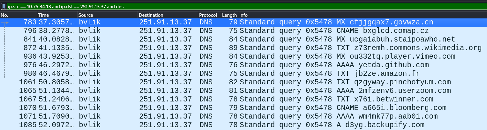
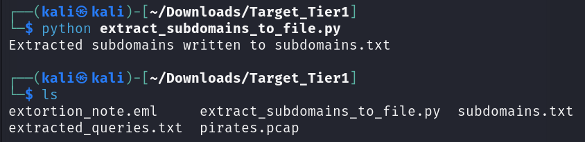
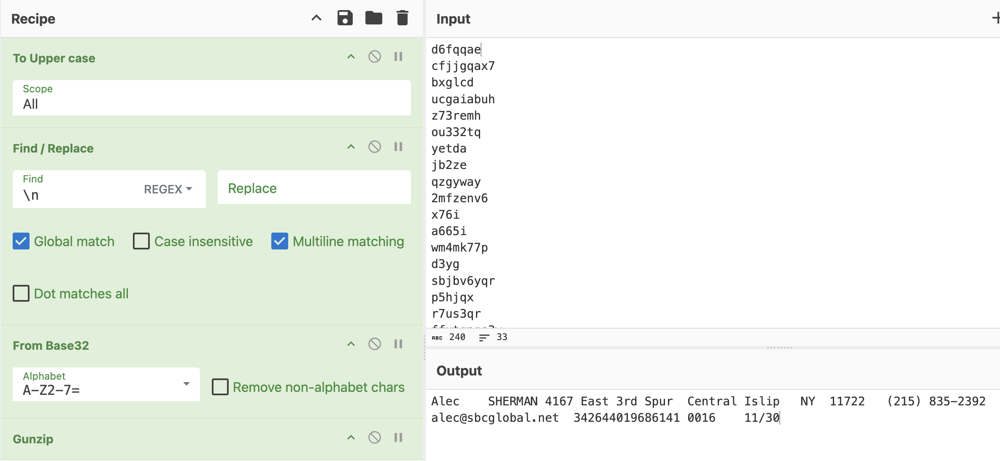

# D6. Smuggled Away!
**Objective:** Discover what data was stolen. 

**Difficulty:** Hard (500 points)

**Category:** Network Traffic Analysis, Data Forensics, Cryptography

## Materials and References
- **Provided:**
    - File from D5: `pirates.pcap`
- **Tools Used:**
    - Wireshark
    - `tshark`
    - CyberChef
- **References:**
    - [tshark options](https://www.wireshark.org/docs/man-pages/tshark.html)
    - [Geeks for Geeks: Copy Contents of One File to Another File (Python)](https://www.geeksforgeeks.org/python/python-copy-contents-of-one-file-to-another-file/)
- **Notes:**
    - Findings from D5:
        - IP source is `10.75.34.13`
        - IP destination is `251.91.13.37` 
        - Protocol Used `DNS`

## Flag Format
**Format:** `‹CreditCardExpiration>_<CVVofCreditCard>_<email>`

For example, if:
- `‹email>` is Alice34@bob.com
- Credit card expiration date is `01/23`
- CVV of credit card is `0987`
- Email is `Alice34@bob.com`

The flag would be:
- `01/23_0987_Alice34@bob.com`

## Write-Up

Opened the pcap file `pirates.pcap` from D5 in Wireshark.

From D5, the following filter was used to identify internal → external DNS traffic:

`(ip.src == 192.168.0.0/16 or ip.src == 10.0.0.0/8 or ip.src == 172.16.0.0/12) and !(ip.dst == 192.168.0.0/16 or ip.dst == 10.0.0.0/8 or ip.dst == 172.16.0.0/12) and udp.port == 53`

Since the source and destination IPs are now known, a simplified filter was used:

`ip.src == 10.75.34.13 and ip.dst == 251.91.13.37 and dns`

This revealed 33 DNS packets.



Based on analysis from D5,  DNS tunneling was used to exfiltrate data. 

To extract the domain names being queried, the following `tshark` command was used:

```Bash
tshark -r pirates.pcap -Y "ip.src == 10.75.34.13 and ip.dst == 251.91.13.37 and dns" -T fields -e dns.qry.name > extracted_queries.txt
```
- `-r`: specifies the input pcap file to analyze
- `-Y`: applies a Wireshark-style display filter, so only packets matching the given condition are processed and included in the output
- `-T fields`: extracts only specified fields, instead of printing the entire packet details
- `-e`: specifies the field to extract
    - `-e dns.qry.name`: extracts the domain name from DNS query packets
- `> extracted_queries.txt`:  redirects the output to a file called `extracted_queries.txt`

Now the queries are saved in `extracted_queries.txt`. 

Only the subdomains, the ciphered text, were needed. A Python script, `extract_subdomains_to_file.py`, was used to extract the subdomains into the file `subdomains.txt`

```Python
input_file = "extracted_queries.txt"
output_file = "subdomains.txt"

with open(input_file, "r") as infile, open(output_file, "w") as outfile:
    for line in infile:
        query = line.strip()
        if not query or '.' not in query:
            continue

        subdomain = query.split('.')[0]
        outfile.write(subdomain + "\n")

print(f"Extracted subdomains written to {output_file}")
```

The script was run with:

```Bash
python extract_subdomains_to_file.py
```



The subdomains were encrypted, so CyberChef was used to decrypt them. 

The ciphered subdomains were copied into CyberChef, without the trailing blank line.

After several failed attempts to decrypt line-by-line, the ciphered text was combined into one continuous string to decode the full string. The attacker may have split the data into chunks, encoded each one separately, and sent them as DNS queries.

Different ciphers were tested.

Base32 decoding was tested, with uppercase conversion required.

In CyberChef, the following operations were applied:

- `To Upper case`
- `Find/Replace`
    - To remove all line breaks
- `From Base32`

CyberChef suggested applying `Gunzip`, which successfully extracted the hidden data.



Deciphered data is

>Alec	SHERMAN	4167 East 3rd Spur	Central Islip	NY	11722	(215) 835-2392	alec@sbcglobal.net	342644019686141	0016	11/30

The stolen data includes:
- CreditCardExpiration: `11/30`
- CVVofCreditCard: `0016`
- Email `alec@sbcglobal.net`

**Flag:** `11/30_0016_alec@sbcglobal.net`