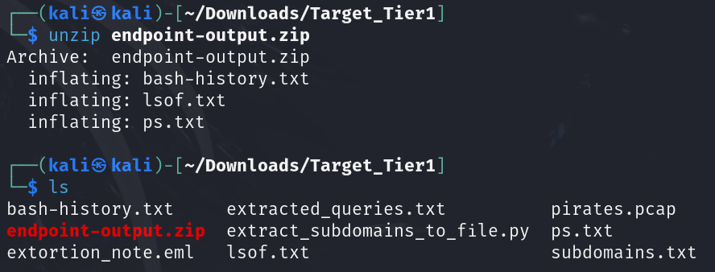
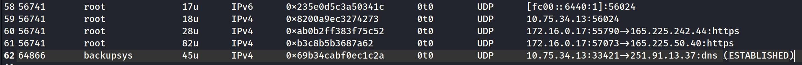
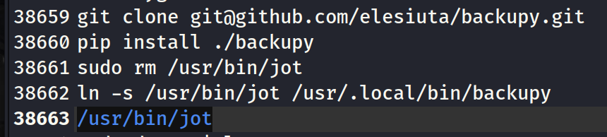

# D7. Endpoints and Exfiltration (100)
**Objective:** Identify the OS process, user, and software that is performing the exfiltration and where the software came from.

**Difficulty:** Easy (100 points)

**Category:** Endpoint Forensics, Process Analysis

## Materials and References
- **Provided:**
    - File: `endpoint-output.zip`, containing:
        - Output of `lsof`
        - Output of `ps`
        - Output of `history`
- **Tools Used:**
    - Text editor (e.g., Mousepad on Kali Linux)
- **References:**
    - [grep-command-linux-unix-examples](https://phoenixnap.com/kb/grep-command-linux-unix-examples)
- **Notes:**
    - Findings from D5:
        - IP source is `10.75.34.13`
        - IP destination is `251.91.13.37` 
        - Protocol Used `DNS`

## Flag Format
**Format:** `USER_FILE_PID`

Need the following information
- the username on the backup server that is running the exfil process (`USER`)
- the name of the executable file that actually created the exfil process (`FILE`)
- the process ID (`PID`) of the process performing the exfiltration

## Write-Up

To unzip the file `endpoint-output.zip`, the following command was used: 

```bash
unzip endpoint-output.zip
```

The zip file contained 3 files, which contained the outputs of the commands `lsof`, `ps`, and `history`:
- bash-history.txt
- lsof.txt
- ps.txt



Focus was placed on one file at a time.

---
### Analyzing lsof.txt

The first file analyzed was `lsof.txt`.

From previous challenges, it was discovered that DNS tunneling was used for data exfiltration. Focus was placed on entries where the `NODE` is listed as `UDP`, since `NODE` did not appear as `DNS` and as DNS traffic typically uses UDP.

The following command was used to filter relevant lines and save the output to a separate file for easier review:

```Bash
grep -E '^PID|UDP' lsof.txt > lsof_UDP.txt
```
- `-E`:
    - Enables extended regular expressions (ERE) to use operators like `^PID|UDP`
- `^`:  Start of the line
    - `^PID`: Captures the header line of the `lsof` output

Opened `lsof_UDP.txt` on a text editor to view the relevant UDP lines. 

The known IP source and destination from D5 were searched:
- IP source: `10.75.34.13`
- IP destination: `251.91.13.37`

One entry showed the internal source IP establishing a UDP (DNS) connection to the external destination IP
> 64866 backupsys 0x69b34cabf0ec1c2a 10.75.34.13:33421→251.91.13.37:dns (ESTABLISHED)



From this line, the following information was identified:
- **USER:** `backupsys`
- **PID:** `64866`

---

### Analyzing ps.txt

Next, the focus shifted to `ps.txt`to idenitfy executable files associated witht he USER and PID found earlier.

The file `ps.txt` was opened in a text editor.

An initial search for the USER returned multiple results, but none matched the PID. Therefore, the PID from `lsof.txt` (`64866`) was searched for instead.

One matching entry was found, which also matched the USER `backupsys`:
> backupsys 64866 0.0 0.3 335145 77433 ? Ssl Mar18 0:05 /usr/bin/jot


This is the command being executed: `/usr/bin/jot`

---

### Analyzing bash-history.txt

Finally, the focus shifted to `bash-history.txt`.

The file was opened on a text editor. 

A search for `/usr/bin/jot` returned 3 matches. With these 3 entries, a few commands prior were also investigated, analyzing a total of 5 commands:
```Bash
git clone git@github.com/elesiuta/backupy.git
pip install •/backupy
sudo rm /usr/bin/jot
ln -s /usr/bin/jot /usr/.local/bin/backupy
/usr/bin/jot
```



From the commands, it shows a repository named **backupy** was cloned from GitHub and installed locally. The remaining commands appear to have masked the malicious file and executed it.
- `sudo rm /usr/bin/jot`: Deletes the legitimate `/usr/bin/jot` executable.
- `ln -s /usr/bin/jot /usr/.local/bin/backupy`: Creates a symbolic link `backupy` → `/usr/bin/jot`
    - This means that running `/usr/.local/bin/backupy` actually runs `/usr/bin/jot`.

Based on this, the malicious executable file was identified as:
**File:** `backupy`

----
**Flag:** `backupsys_backupy_64866`