# D8. Shadow Commit
**Objective:** Find the commit hash where the malicious change was introduced and obtain the malicious IPv4 address.

**Difficulty:** Easy (100 points)

**Category:** Git Forensics, Source Control, Data Analysis

## Materials and References
- **Provided:**
    - File: `shadow.zip`, containing a `.git` directory (version history only)
- **Tools Used:**
    - Terminal
    - `unzip`
    - `git`
    - `grep`
    - `sort`
    - CyberChef
- **References:**
    - [atlassian: git log tutorial](https://www.atlassian.com/git/tutorials/git-log)
    - Stackoverflow
      - [regex to parse or validate base64 data](https://stackoverflow.com/questions/475074/regex-to-parse-or-validate-base64-data)
      - [how to show changed file name only with git log](https://stackoverflow.com/questions/14207414/how-to-show-changed-file-name-only-with-git-log)
      - [view the change history of a file using git versioning](https://stackoverflow.com/questions/278192/view-the-change-history-of-a-file-using-git-versioning)
      - [whats the difference between git reflog and log](https://stackoverflow.com/questions/17857723/whats-the-difference-between-git-reflog-and-log)
    - [the invisible commits](https://megakemp.com/2017/10/19/the-invisible-commits-part-one/)
    - [w3schools: git amend](https://www.w3schools.com/git/git_amend.asp)

- **Notes:**
    - Findings from D7:
        - The malicious file was identified as `backupy`

## Flag Format
**Format:** `###.###.###.###`

(IPv4 address format)

## Write-Up

To unzip the file `shadow.zip`, the following command was used: 

```Bash
unzip shadow.zip
```

<p align="center">
  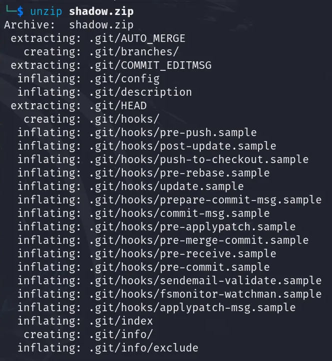
</p>

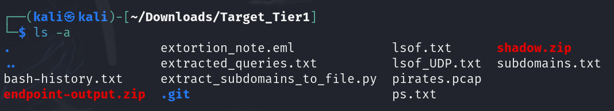

The extracted .git directory only contained the version history. To identify the malicious IPv4 address, the Git commit history was investigated to trace changes to the repository.

The following command displays the full commit history (most recent first):
```Bash
git log
```
<p align="center">
  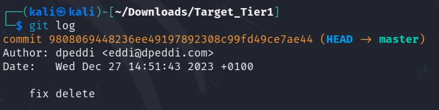
</p>

Several initial commands were used to investigate the commit history.

- The command `git log --oneline` was used to display a compact view of the commit history, showing only commit hashes and the first line of their messages. Specific commits were investigated based on the preview message using `git show <commit_hash>`, but no ciphertext was found in the commits examined.

<p align="center">
  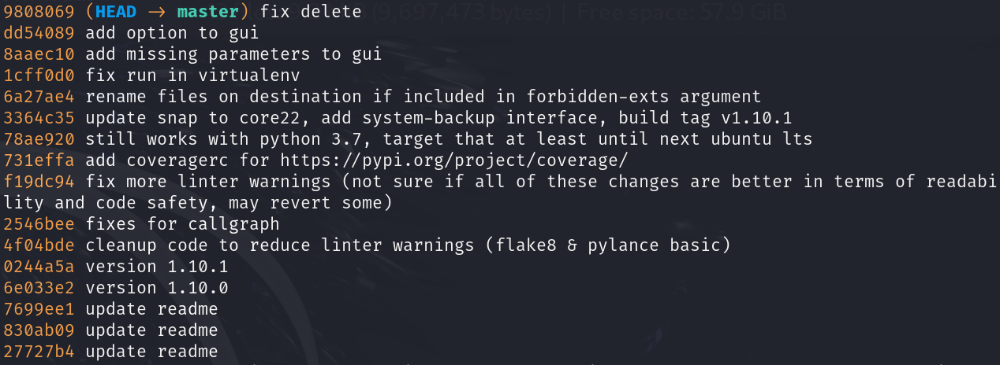
</p>

- The command `git log --name-only` was used to view the filenames modified in each commit. Focus was placed on `.py` files, particularly any related to `backupy` (referenced in Challenge D7), but this approach did not yield useful results.

<p align="center">
  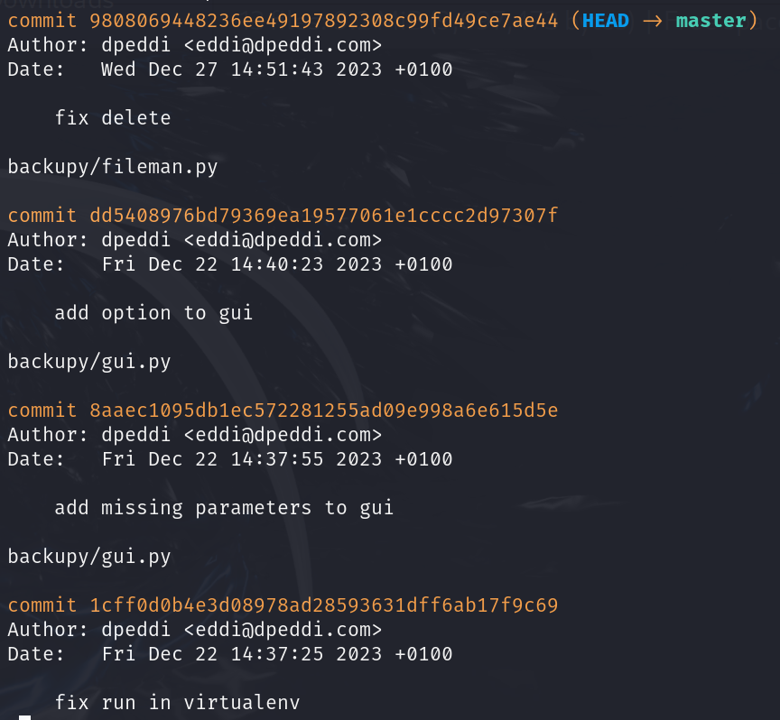
</p>

With no findings from direct commit inspection, multiple alternative approaches were explored to locate the malicious content.

Below are four different methods that successfully identified the ciphertext.

---

### 🔍 Method 1: Grep for Base64 Patterns *(Used to Solve)*

Focus shifted to inspecting commit diffs for potential ciphertexts.

CyberChef was listed under the challenges required tools, indicating some decoding needed to be performed. This led to the assumption that the malicious content may be encoded

Using `grep`, a query was made to search for base64 ciphertexts, since it is a commonly used cipher. A previous attempt to search for the string `"base32"` returned no results, so this encoding method investigated. 
> **Note (post-analysis):** Searching for `"base64"` directly could have confirmed the encoding method. However, querying for base64 ciphertext using regex would perform both detection and extraction of the encoded data. This also served as an opportunity to practice using `grep` for pattern-based extraction.

The following command was used to save base64 matched strings in `commit_diff_ciphers.txt`:
```Bash
git log -p | grep -Eo '[A-Za-z0-9+/]{12,}={0,2}' | sort -u > commit_diff_ciphers.txt
```
- `git log -p`: outputs all the content changes (diffs) across commits
    - `-p`: displays the patches (code difference) for each commit, showing added/removed lines 
- `-E`: enables extended regular expressions
- `-o`: outputs only the matching parts of each line, not the entire line
- `[A-Za-z0-9+/]{12,}={0,2}`:  regular expression that matches base64 encoded strings
    - Includes standard base64 characters: A–Z, a–z, 0–9, `+`, `/`  
    - `{12,}`:  matches strings of 12 or more characters to reduce false positives of short matches
        - Value of 12 was chosen based on the flag format
- `sort -u`: sorts and filters for unique matched strings 
    - `sort`: sorts all the matched strings in ascending order
    - `-u`: removes duplicate lines to display only unique strings  

<p align="center">
  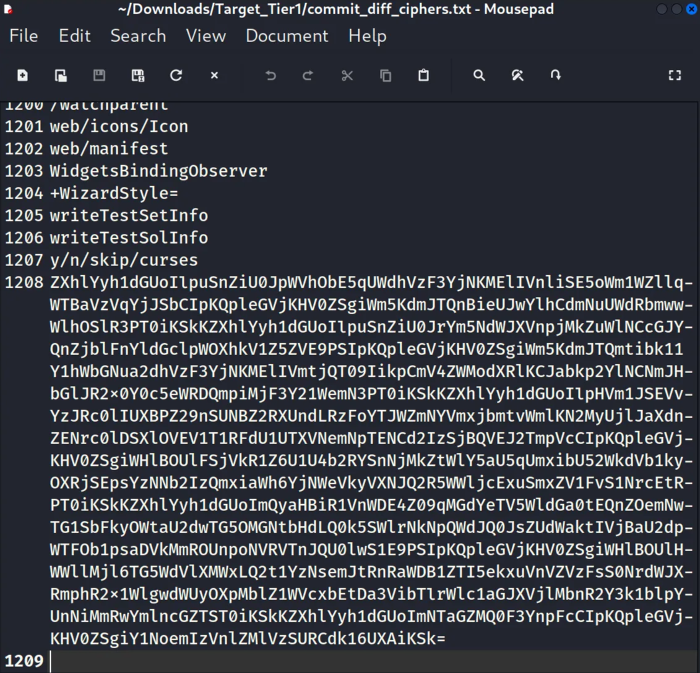
</p>

The output also included non-ciphered texts.

Most of the ciphertext strings appeared to be commit hashes, which was confirmed with `git show`. 

However, one string at the end of the output stood out due to its length. It was a long base64 string. Focus was directed toward this string for further analysis.

### 🔍 Method 2: Investigating Shadow Commits

Based on the challenge title *Shadow Commit*, research suggested it could refer to hidden or invisible commits within a Git repository. These types are commits may have been amended, rebased, or removed from the visible history.

The following command was used to review all types of commits:
```Bash
git reflog
```
- `reflog`: displays updates to the HEAD and branch references, including commits that were reset, rebased, amended, or removed from the visible history.
    - It keeps a history of reference movements, allowing access to commits even after they’ve been rewritten or detached.

<p align="center">
  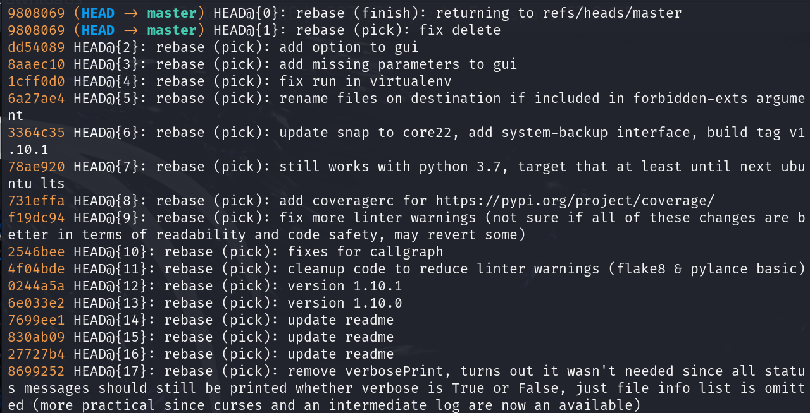
</p>

The reflog output showed 40 entries. Among them, one commit stood out:
> b188b42 HEAD@{37}: commit (amend): deprecate copy_function class attribute for newer FileOps

This commit was labeled **commit (amend)**, indicating that it has been modified after the original version was created and pushed. An amended commit replaces the previous one. This suggests a possibility of overwritten content.

The commit hash was used to display its contents, leading to the discovery of the ciphertext.
```Bash
git show b188b42
```

<p align="center">
  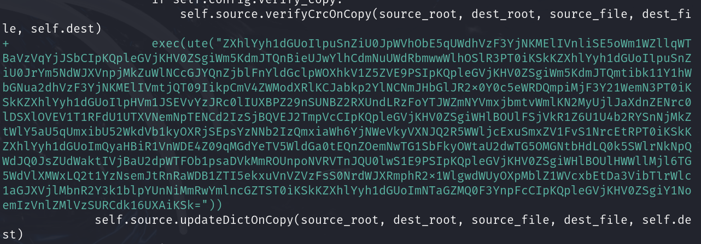
</p>

### 🔍 Method 3: Inspecting backupy

From D7, **backupy** was identified as the malicious executable. To investigate files related to **backupy**, the following command was used to list files with changes across commits:
```Bash
git diff --name-only
```

<p align="center">
  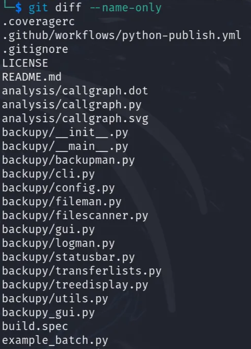
</p>

There are 14 files changed in backupy:
- backupy/__init__.py
- backupy/__main__.py
- backupy/backupman.py
- backupy/cli.py
- backupy/config.py
- backupy/fileman.py
- backupy/filescanner.py
- backupy/gui.py
- backupy/logman.py
- backupy/statusbar.py
- backupy/transferlists.py
- backupy/treedisplay.py
- backupy/utils.py
- backupy_gui.py

Each file was inspected for commit history using:
```Bash
git log -p -- <filename>
```

Most files either had no relevant commits or did not contain any ciphertext. The sixth file, **backupy/fileman.py**, stood out for containing a long suspicious ciphertext:
```Bash
git log -p -- backupy/fileman.py
```

File and commit details:
- Author: eric
- File Name: backupy/fileman.py
- Commit hash: b188b42c34f772d2d9ccc006692d65cd597fc57d

<p align="center">
  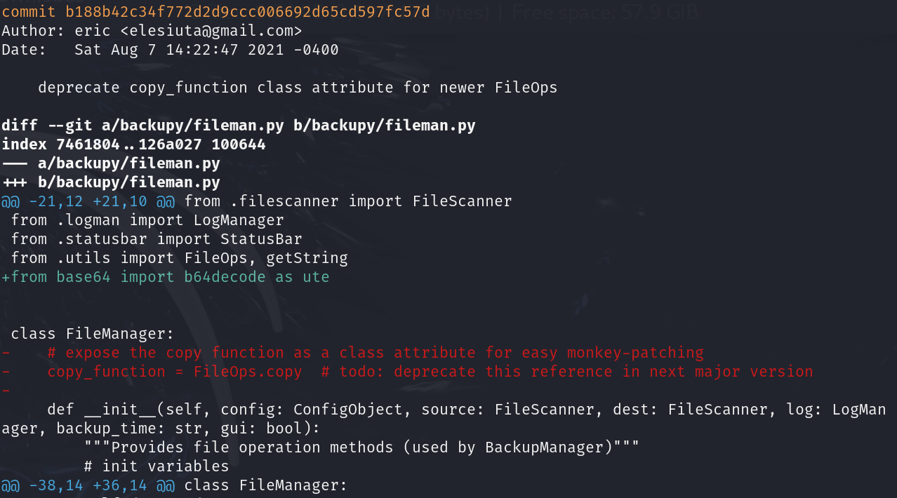
</p>

The commit revealed the ciphertext within the file changes.

<p align="center">
  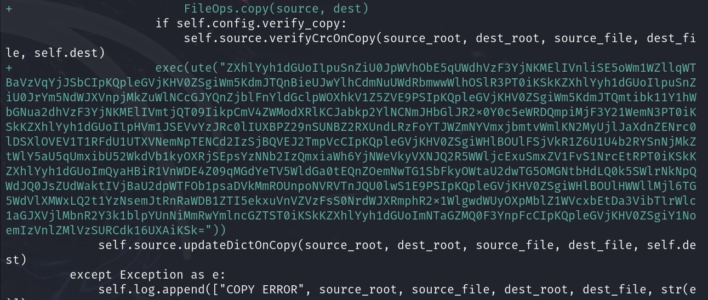
</p>

### 🔍 Method 4: Grep for Imports

In earlier attempts, terms like udp, dns, and query were searched using grep, but no relevant results were returned.

To explore further, the focus shifted to identifying which Python modules were imported in the commit history. This can help reveal hidden behavior or unusual dependencies.

The following command was executed to search for all added import statements:
```Bash
git log -p | grep -iE '^\+import\s+([a-zA-Z0-9_./]+)|^\+from\s+([a-zA-Z0-9_./]+)\simport\s+([a-zA-Z0-9_./]+)' | sort -u
```
- `^\+import\s+([a-zA-Z0-9_./]+)`: Matches lines where line starts with import
- `^\+from\s+([a-zA-Z0-9_./]+)\simport\s+([a-zA-Z0-9_./]+)`: Matches lines where line is formatted as “from ... import ...”
- The `^\+` prefix limits matches to lines added in commits, focusing only on newly introduced imports.

<p align="center">
  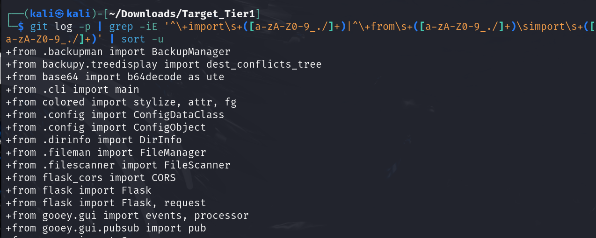
</p>

One import stood out: 
> +from base64 import b64decode as ute

This import uses an alias (**ute**) for **b64decode**, suggesting an attempt to disguise base64 decoding behavior.

To locate where this alias was used, the following command was run:
```Bash
git log -p | grep -E 'ute\(’
```
- `ute\(`: searches for function calls to ute

This led to the location in the commit history where the ciphertext was being decoded using the ute function.

<p align="center">
  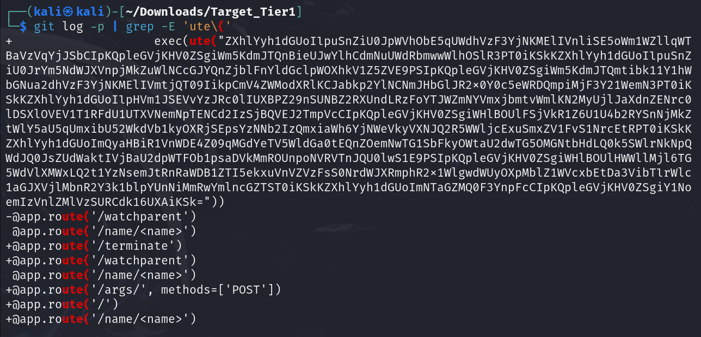
</p>

---

### Deciphering the Ciphertext

CyberChef was used to decode the Base64 ciphertext.

<p align="center">
  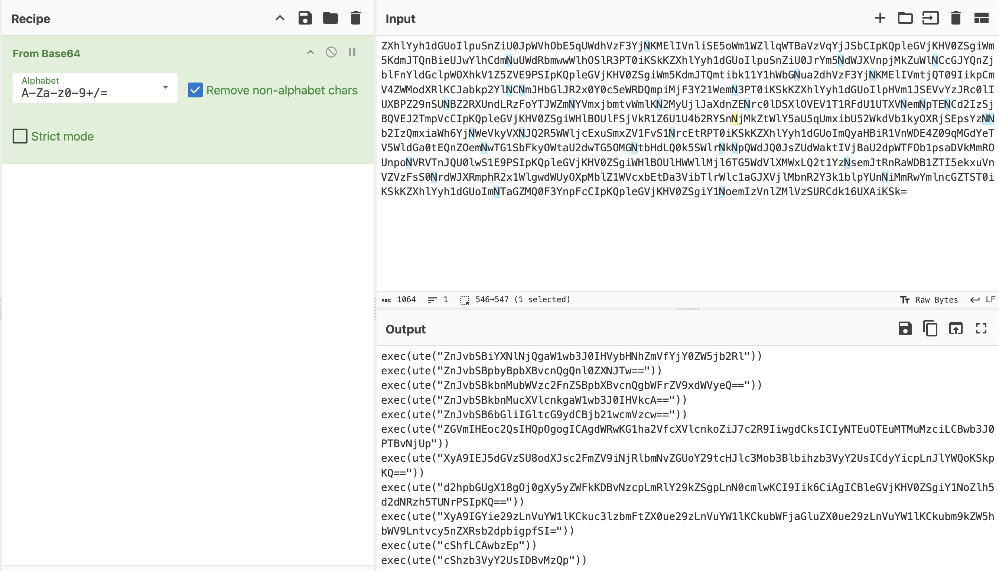
</p>

There are multiple `exec()` functions with ciphertexts being decoded with **ute** function. Per ciphertext, decoded with Base64 to find one that made the udp query. 

Multiple `exec()` calls decode ciphertext using the **ute** alias (which maps to b64decode). Each ciphertext was inspected until the IP Address was found.

<p align="center">
  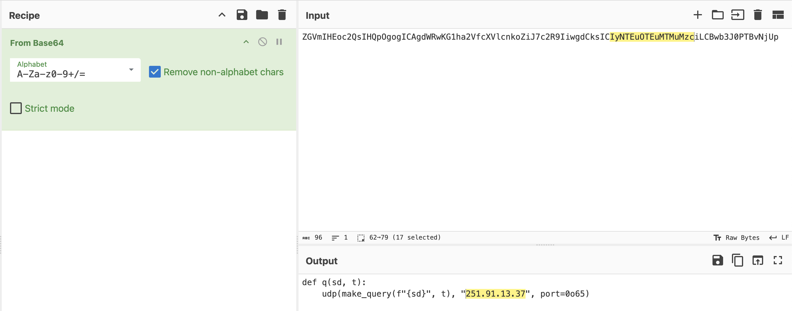
</p>

The recovered plaintext contains the UDP query and destination address:
> udp(make_query(f"{sd}", t), "251.91.13.37", port=0o65)
---
**Flag**: `251.91.13.37`