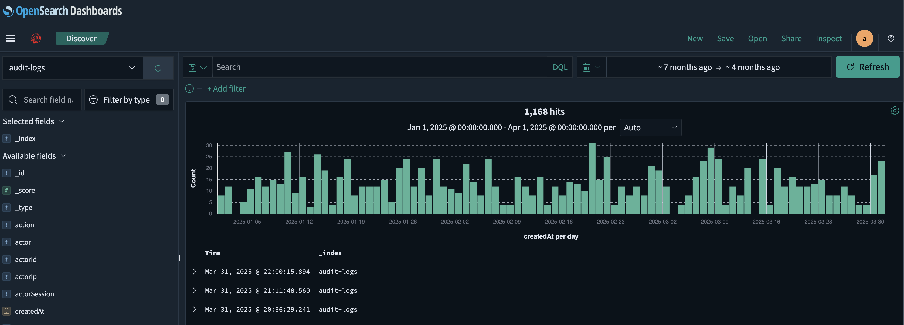
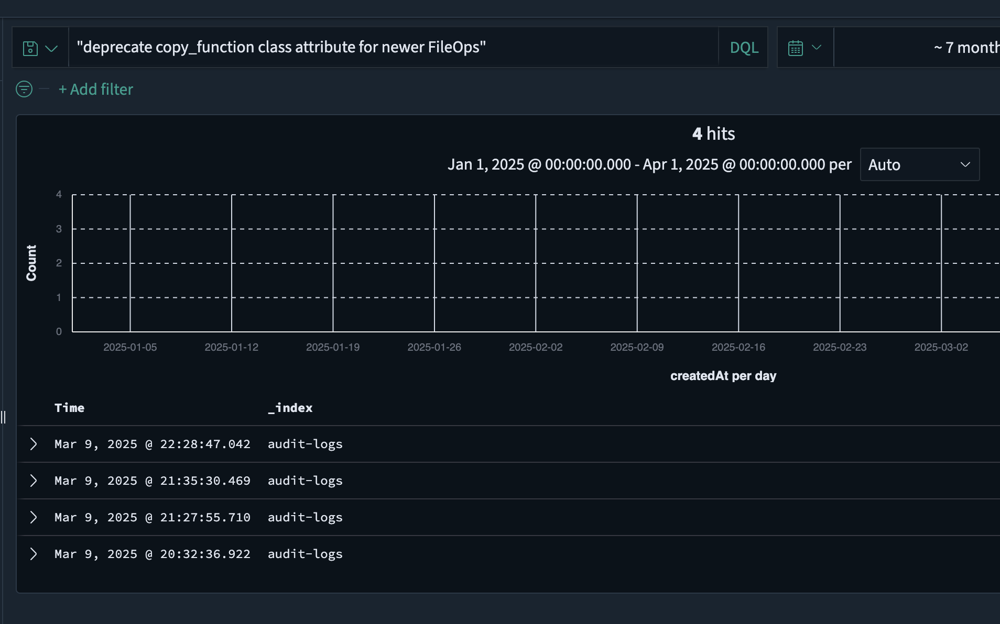
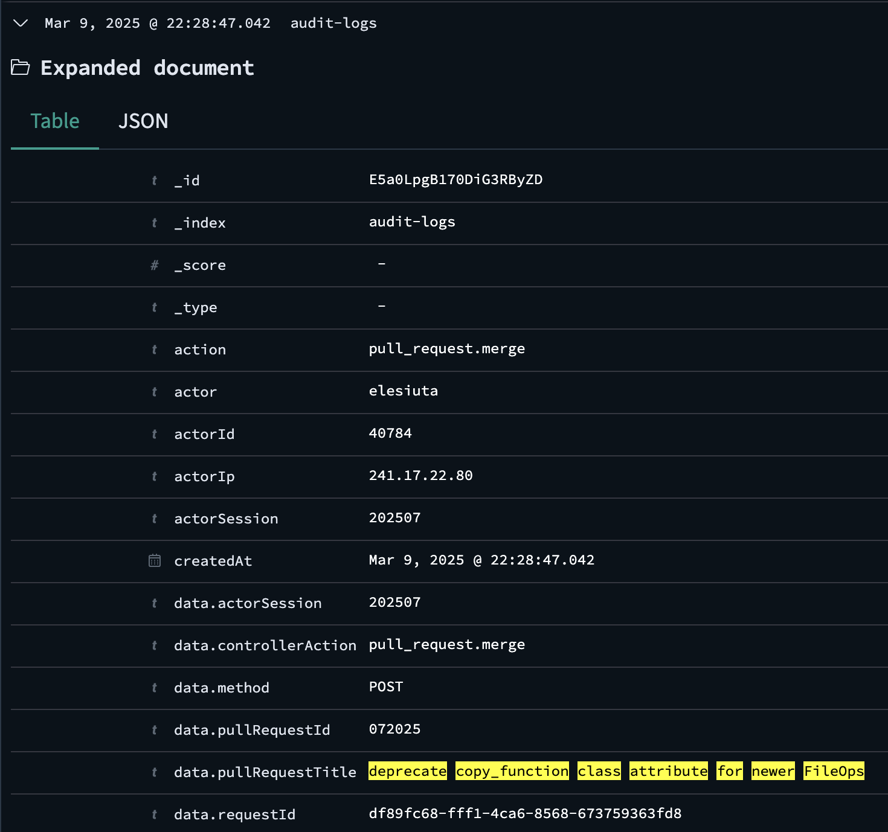

# D9. Logging for Truth
**Objective:** Find the IPv4 address that added malicious code to the application.

**Difficulty:** Medium (300 points)

**Category:** Log Analysis, Git Forensics

## Materials and References
- **Provided:**
    - Link: Insightful Horizon (OpenSearch dashboard), used the `audit-logs` index
- **Tools Used:**
    - OpenSearch Dashboard (via browser)
- **References:**
    - None
- **Notes:**
    - Given credentials from D2:
        - Username: `analyst`
        - Password: `analyst`
    - Findings from D8:
        - commit log message is `deprecate copy_function class attribute for newer FileOps`

## Flag Format
**Format:** `###.###.###.###`

(IPv4 address format)

## Write-Up

Used the provided credentials from D2 to log into Insightful Horizon, an OpenSearch dashboard. The `audit-logs` index was selected for analysis.

Initially searched for **eric** (the commit author from D8) and **251.91.13.37** (the exfiltration IP from D8), but these returned no results.

Since the logs are from GitHub, the commit message from D8 was used instead:
> deprecate copy_function class attribute for newer FileOps

The message was searched in quotes to enforce an exact match.

  

This returned 4 logs. The most recent log entry was selected for review.

  

Log entry details:
- `actor`: `elesiuta`
- `action`: `pull_request.merge`
- `controllerAction`: `pull_request.merge`
- `actorIp`: `241.17.22.80`

The `action` and `controllerAction` fields both show `pull_request.merge`, indicating that the commit was amended and then merged. This is the standard behavior when a previously pushed commit is modified. It confirms that this log entry corresponds to the amended commit identified in D8.

---
**Flag**: `241.17.22.80`