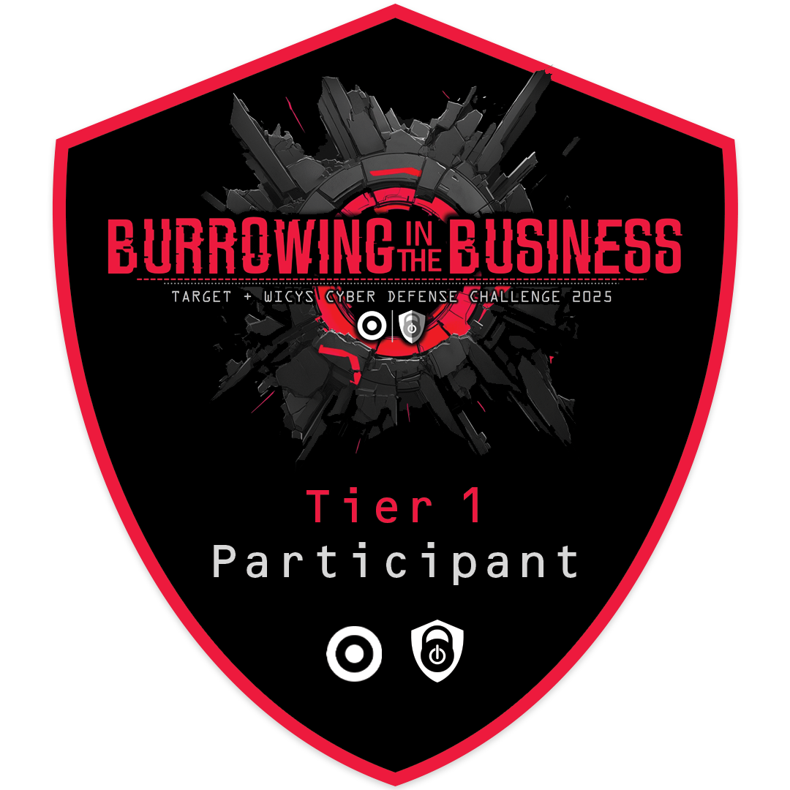
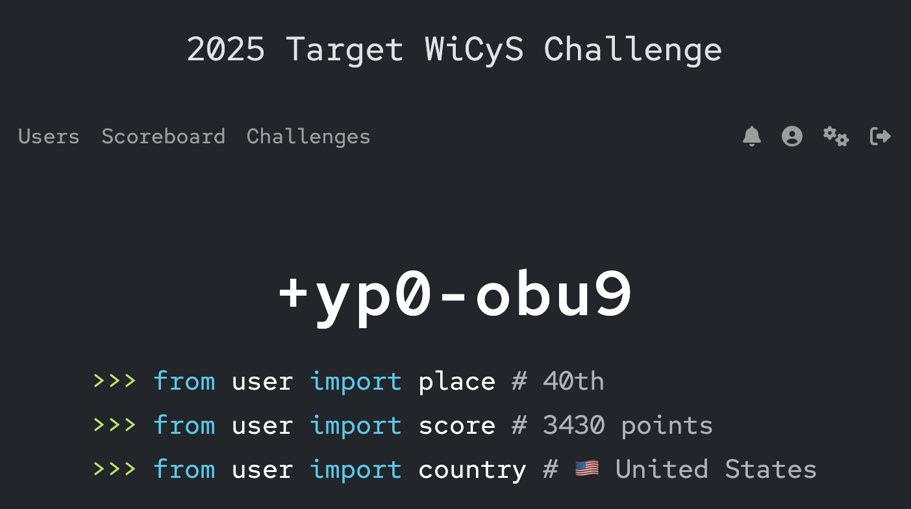

# 🛡 Tier 1: Play the Defender 🛡

**Theme:** A ransom demand has been received. Play the defender to identify the intrusion and determine how data was exfiltrated. 

  

## 🔍 Challenges

12 out of 13 challenges completed:
- [D1. Mystery Mail](./D1_Mystery_Mail.md) – Identify the sender’s IP from an extortion email  
- [D2. Not-so-Simple Mail Protocol](./D2_Not_so_Simple_Mail_Protocol.md) – Trace the first extortion attempt in logs 
- [D3. Ransom Wrangler](./D3_Ransom_Wrangler.md) – Negotiate wiht the attacker
- D4. Trout of Office
-  [D5. Ahoy, PCAP'n!](./D5_Ahoy_PCAP'n.md) – Identify which machine is sending stolen data and where it went
-  [D6. Smuggled Away!](./D6_Smuggled_Away.md) – Discover what data was stolen
-  [D7. Endpoints and Exfiltration](./D7_Endpoints_and_Exfiltration.md) – Identify the process, user, and software used for exfiltration  
-  [D8. Shadow Commit](./D8_Shadow_Commit.md) – Find malicious IPv4 address within the commit history

## 🏆 Placement & Points

The following image shows final ranking and total points earned:

  

