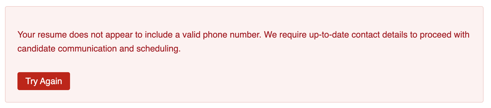

# O1: Remarkable Resume
**Objective:** Identify the real job listing and craft a resume that passes all criteria.

**Difficulty:** Easy (200 points)

**Category:** Web Exploitation, Social Engineering

## Materials and References
- **Provided:**
    - Link: Personalyzed website
- **Tools Used:**
    - Web Browser
    - Text editor (e.g. Google Docs)
    - ChatGPT

## Flag Format
FLAG{...}

## Write-Up

The provided link opened to Personalyzed website. In the `Join Us` section, there is a link labeled `View Open Roles`. 

<p align="center">
  
  
</p>

The link`View Open Roles` navigates to the `Career` page with 7 job listings available.

<p align="center">
  
</p>
. 

The challenge description mention there are ghost jobs within the job listings. To determine the real job, a resume will be submitted to see the response. 

The resumes contents used were generated in ChatGPT using the job's description. The contents were copied and formatted in Google Docs. It was exported as PDF as required from the job listing.

<p align="center">
  
</p>

The first few attempts returned the same rejection message, indicating they were ghost jobs.
> Thank you for your interest in this role. After careful consideration, we will not be moving forward with your application at this time. We encourage you to explore other open positions at Personalyz.io.

<p align="center">
  
</p>

The job listing for `Senior Backend Engineer` returns a different response. The response was a feedback message, indicating this is a real job listing.
> Thank you for your submission. We found that your resume exceeds our preferred length (387 words). Please limit your resume to the most relevant experiences and aim for conciseness.

<p align="center">
  
</p>

A revised resume was submitted and another feedback message was recieved. For each feedback message, the resume was edited to fit the criteria.

Examples of feedback include:
> Your resume does not appear to include a valid phone number. We require up-to-date contact details to proceed with candidate communication and scheduling.

<p align="center">
  
</p>

> We appreciate your interest, but please limit your resume to a single page. We value concise, focused communication that highlights only the most relevant experience.

<p align="center">
  
</p>

> We appreciate your interest, but your resume appears too brief (159 words). We encourage you to elaborate more on your relevant experience, projects, and achievements.

<p align="center">
  
</p>

> While we appreciate your qualifications, we are currently focusing on candidates located within or near our primary operating region's timezone to ensure optimal overlap in working hours and team collaboration. Our ATS flagged zip code (N/A) as not compatible with our company's mission.

<p align="center">
  
</p>

After many refinements, the following final resume aligns with the role's expectations and passes the company's screening
- PDF format
- role experience
- word count between 159-387 words
- valid contact details (phone number included)
- single page
- postal code within the operating region

```text
Elias Rowan
Brooklyn Park, MN 55443 | elias.rowan@protonmail.com | (612) 348-1924 | github.com/erowan

Summary
Senior backend engineer with 7+ years of experience designing and delivering scalable, privacy-first backend systems. Skilled in Python, Go, Kubernetes, and database optimization, with a strong focus on secure API design and CI/CD automation.

Skills
Python · Go · Docker · Kubernetes · PostgreSQL · Redis · Terraform · REST · GraphQL · CI/CD · GitHub Actions · OAuth2

Experience
Privexa Systems — Senior Backend Engineer
 Remote · 2021–Present
Designed and deployed scalable REST and GraphQL APIs in Go and Python powering consent management and analytics.
Optimized database queries and Redis caching, reducing API latency by 45% and increasing throughput by 30%.
Built and maintained CI/CD pipelines using Terraform and GitHub Actions, enabling frequent reliable deployments.
Led architecture and code reviews to enforce best practices and mentor junior engineers, improving team code quality.

DeltaLayer Analytics — Backend Engineer
 Minneapolis · 2017–2021
Developed GDPR-compliant data ingestion pipelines and internal authentication services with FastAPI and OAuth2.
Deployed containerized microservices on Kubernetes clusters using Docker and Helm, ensuring high availability.
Collaborated with data scientists to implement secure data processing and privacy controls aligned with company policies.

Education
University of Minnesota — B.S. Computer Science, 2016

Certifications
Certified Kubernetes Administrator (CKA) – 2024 | HashiCorp Terraform Associate – 2023

Projects
ConsentAPI — Open-source platform providing API-driven consent management using Python and GraphQL.
AuditCache — Redis-backed tool for secure, tamper-evident audit logging used in compliance reporting.
```

After submitting the final resume and passing the screening, the flag was returned.

**Flag**: `FLAG{You're hired!}`

<p align="center">
  
</p>