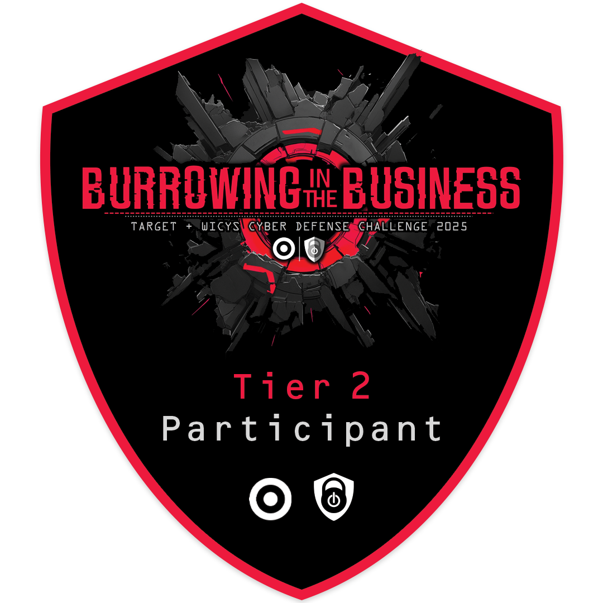
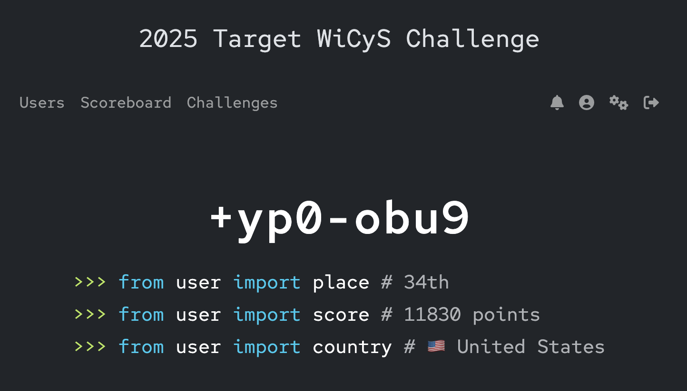

# 💥 Tier 2: Execute the Attack 💥

**Theme:** Rewind the clock and conduct the attack.

  

## 🔍 Challenges

Kick Off: Congratulations Tier Two!

10 out of 11 core challenges completed

| ID | Title | Description |
|----|-------|-------------|
| [01](./O1_Remarkable_Resume.md)     | Remarkable Resume    | Identify the real job listing and craft a resume that passes all criteria.         |
| [O2.1](./O2.1_Touchy_Templates.md)  | Touchy Templates     | Confirm SSTI vulnerability and retrieve sensitive data.                            |
| [O2.2](./O2.2_Friendly_Files.md)    | Friendly Files       | Exploit LFI vulnerability to retrieve sensitive data.                              |
| O2.3  | Naughty Network                               | TBA         |
| O3    | Escalation of Power                           | TBA         |
| O4.1  | Permission Pathways                           | TBA         |
| O4.2  | Lousy LDAP                                    | TBA         |
| O4.3  | Suspicious SMB                                | TBA         |
| O4.4  | Legal Lockbox                                 | TBA         |
| O4.5  | Mystery Messenger                             | TBA         |
| O5    | Tunnel Vision                                 | DNF         |
| 🟨 **Bonus Challenge** | | |
| O6    | We're Calling About Your Extension's Warranty | DNF         |

## 🏆 Placement & Points

The following image shows final ranking and total points earned:

  

